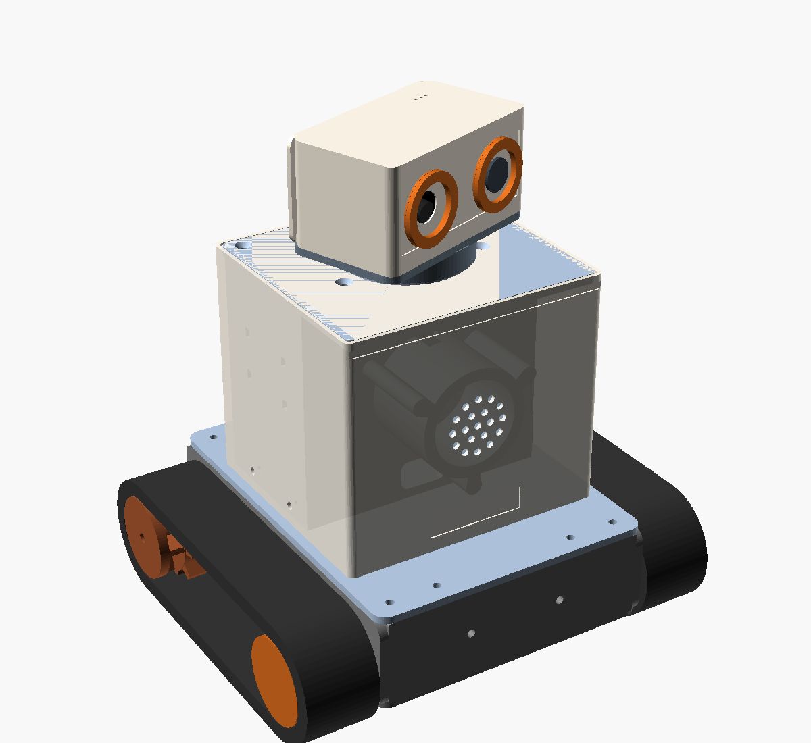

# ARES-1 工程設計書 · 主版本 B（直立式、頭可轉、雙履帶）

> 一句話：把兩顆 64 mm 長的馬達「一前一後斜對角」塞進 110 mm 寬的底盤，把最重的電池壓在最低處、從後門抽換，
> 再讓一顆 13 g 的伺服只負責「轉」、不負責「扛」。直立式的角色感留給頭和身體，穩定性交給底盤。



| 項目 | 數值 | 狀態 |
|---|---|---|
| 外形 W × L × H | 181 × 160 × 203 mm | 設計值 |
| 估計重量 | 約 920 g | 估計 |
| 重心高度 | 61.2 mm（總高 30%） | 估計 |
| 翻覆角 前／後／側 | 42.9° ／ 41.8° ／ 55.0° | 估計 |
| 離地間隙 | 11.7 mm | 設計值 |
| 頭部轉角 | ±45°（機械限位 ±55°） | 設計值 |
| 鏡頭 | 在右眼，離地約 182 mm，俯角 10° | 設計值 |
| 履帶 | 3D 列印，節距 12.5、寬 30、每邊 28 片 | 設計值 |

互動式 3D 模型：`web/index.html`（直接用瀏覽器開，需要網路載入 Three.js）。
可列印 CAD：`cad/ares1.scad` ＋ `cad/ares1_params.scad`，STL 在 `cad/stl/`。

尺寸標記：**[C] 已確認**（你提供的或商品圖）、**[E] 估計**、**[M] 待量測**、**[D] 設計值**（我選的，可以改）。

### 目前已依實物資料更新的零件

| 零件 | 從照片確認的事 |
|---|---|
| GOOUUU ESP32-S3-CAM（N16R8） | 2 × 20 排針絲印、OTG＋TTL 兩個 USB-C 在同一端、板載 WS2812、天線突出 PCB 約 4 mm、**相機是軟排線接的，平常貼在模組鐵殼上，偏天線端約 20 mm** |
| JGA25-370 | 軸根 Ø7 銅套、D 切面 3.5、M3 孔距 17、編碼器 6P 接頭在編碼器蓋側面 |
| DRV8870 雙路模組 | 端子 VM G OUT1–4 在一條長邊、排針 IN1–4 VO G S1 G S2 G 在另一條長邊、板上 LM317M 可調輸出 VO、0.1 Ω 取樣電阻 |
| MAX98357A | 腳位 LRC BCLK DIN GAIN SD GND Vin，上方兩孔距 12.6、孔心到底邊 16.7 |
| INMP441 | 10 × 10，腳位 L/R WS SCK｜GND VDD SD，收音孔在元件面（金屬殼上） |
| SG92R | 23.2 × 12.1 × 22.7、耳片跨距 32.1、含軸總高 30.5、含線約 13 g |

---

## 0. 常見問題（先回答你問的）

### 電池放在裡面，要怎麼換？

電池不是「關在身體裡」，是坐在一個**抽屜**上，抽屜從**車尾的後門**整個滑出來：

1. 關掉頂板上的開關。
2. 捏住後門外面的拉片往後拉。後門是用兩顆 Ø6 × 2 釹磁鐵吸在後壁上，一拉就開。
3. 抽屜沿著底盤右側通道滑出約 9 cm，2 節 18650 的電池盒整個露出來。
4. 換上充好的電池（看清楚 +／−），推回去，磁鐵「喀」一聲吸住。

整個過程**不用拆外殼、不用拆頭、也不用把車翻過來**（直立車翻面最容易壓壞頭和伺服）。
網頁的「顯示 → 換電池示範」會把這個動作跑給你看。

為什麼抽得出來：這就是選「對角馬達」的主要原因。左馬達在車尾左側，只佔 x = −9 … 55；右側留下一條 40 mm 寬、從車尾一路通到中段的空通道，電池就放在那裡。
如果兩顆馬達都放在後面（方案 A），後面整排被馬達擋住，電池只能從前面換，會擋到未來的任務模組。

充電建議：營隊把電池拿出來用外接充電器集中充，比在車上加充電模組安全。

### SG92R 夠力嗎？要不要換 MG996R？

**SG92R 夠，而且比 MG996R 更適合。**

- 頭部（頭罩＋轉盤＋ESP32＋麥克風＋線）約 69 g，轉動慣量約 50 kg·mm²。
- 就算用 SG92R 最快的速度（0.1 s／60°）急轉急停，只需要約 21 mN·m；SG92R 在 4.8 V 約 245 mN·m，**安全係數約 12 倍**。
- 頭的重量和撞擊由頂板的軸環／頭部裙邊承受，伺服軸只負責轉，不會被壓歪。

MG996R 反而是負擔：55 g（重心變高）、堵轉電流約 2.5 A（5 V 降壓模組會被拖垮、ESP32 容易重開機）、尺寸大到頸部要重畫，而且便宜版常有抖動。
MG996R 可以留給未來真的要扛東西的手臂。

### 一顆伺服需要伺服驅動板嗎？

**不需要。** ESP32-S3 的 LEDC 可以直接輸出 50 Hz PWM，SG92R 吃 3.3 V 訊號沒問題。只要注意：

- 伺服的電源（紅線）接配電板的 5 V，**不要**從 ESP32 的 5V 腳取電。
- 伺服的地（棕線）和 ESP32 共地。
- 訊號（橘線）接 GPIO2。

LU9685 這類 16 路 PWM 板是給「很多顆伺服」或「沒有 PWM 腳」的情況，這台車用不到。

### 馬達的霍爾編碼器要接回 ESP32-S3

可以，而且值得：有了速度回授，兩邊履帶可以跑一樣快，車子才走得直。做法見第 7.3 節，重點是：

- **A 相先接**：左馬達 → GPIO19、右馬達 → GPIO20（OTG 口的腳位，所以改用 TTL 口燒錄）。方向用馬達指令判斷就好。
- **B 相選配**：GPIO3、GPIO46。GPIO46 在燒錄時必須是低電位，燒不進去時拔掉 J2 或把輪子轉一下。
- **編碼器一定要吃 3.3 V**：ESP32-S3 的腳位不耐 5 V。把 DRV8870 模組上的 LM317M 輸出 VO 用可變電阻調到 3.3 V 給編碼器，每條訊號線再串 1 kΩ。

---

## 1. 三種直立式配置，為什麼選 B

| | A 同軸後置 | **B 對角馬達（主方案）** | C 長頸桅杆 |
|---|---|---|---|
| 馬達擺法 | 兩顆都在車尾、同一軸線對頂 | 左馬達在後、右馬達在前，前後錯開 | 同 B |
| 兩馬達干涉 | 內寬 110 會**重疊 18 mm**，要加寬到 ≥ 132 | **完全錯開**，最近距離 86.5 mm | 同 B |
| 整車寬 | 205 mm | **181 mm** | 181 mm |
| 重心 | 偏後 | 前後平衡（z 偏移 −1.1 mm） | 高 7 mm（68.3 mm） |
| 換電池 | 後方被馬達擋住，只能改前門 | **右側通道直接從後門抽出** | 同 B |
| 頭部 | 同 B | 線束最短、最穩 | 桅杆會晃、線束多 70 mm |
| 鏡頭 | 同 B | 離地 182 mm | 離地 252 mm，看得最遠 |
| 結論 | 不選 | **主方案** | 備選：比賽需要看遠時再用 |

C 其實不會翻（前翻門檻 7.9 m/s² 仍大於抓地力 6.9 m/s²），但安全餘裕從 27% 掉到 14%，而且頭部多一根 70 mm 的槓桿，每次急停都會點頭。

網頁「參數 → 配置方案」可以切換 A/B/C，A 在 110 mm 內寬時會直接亮紅色干涉。

---

## 2. 分層與高度

座標：X＝車子左側、Y＝向上、Z＝車頭方向，原點在地面中心。

| 層 | 高度範圍 (mm) | 內容 |
|---|---|---|
| 底盤層 | 0 – 52 | 履帶、底盤槽（一體列印）、兩顆 JGA25-370、電池抽屜、DRV8870、保險絲、J1/J2 |
| 身體層 | 52 – 148 | 上身骨架（底板兼底盤上蓋）、外殼套筒、喇叭、MAX98357A、降壓、配電板、開關、SG92R |
| 頭部層 | 148.5 – 203 | 頸座軸環、頭部轉盤、頭罩、後蓋、ESP32-S3-CAM、INMP441 |

關鍵高度：履帶銷線 4.0、軸心 24.2、履帶頂 48.5；底板 12.0–14.5、電池 16.1–41.1、上身底板 49.1–52.1；
身體 52.1–148.1；伺服底 125.7、舵盤頂 156.6、頭部轉盤底 158.6、鏡頭中心 181.6、頭頂 202.6。

---

## 3. 底盤層

### 3.1 履帶（推薦：3D 列印履帶片）

| 項目 | 數值 | 狀態 |
|---|---|---|
| 節距／鏈輪齒數 | 12.5 ／ 10 齒 → 節圓 40.45（就是 Ø41） | D |
| 軸距 | 111.5 → 一圈 350.08 mm ＝ 28 片（理論 28.006） | D |
| 寬／片厚／抓地齒 | 30 ／ 5 ／ 1.5 | D |
| 插銷 | 1.75 mm 線材，兩端用烙鐵燙平 | D |
| 張緊 | 惰輪軸在 ±4 mm 長槽內調整 | D |

推薦自己印的理由：現成橡膠履帶的節距和內齒要配它自己的輪子；印的可以把數字湊整、壞一片換一片，組履帶本身也是好的營隊活動。
每片中間有 9 × 5.6 mm 齒窗讓鏈輪咬合。一台 56 片，16 片一盤（`track_links_16.stl`），建議 PETG。

### 3.2 馬達固定

- 底盤槽**一體列印**：左右側壁就是馬達座。左馬達在車尾（z = −55.75），右馬達在車頭（z = +55.75）。
- 兩個 M3 孔（孔距 17）**上下排列**，這樣編碼器蓋上的白色 6P 接頭會朝上，插線不會卡到底板。
- 用 **M3 × 6 圓頭（ISO 7380）** 從側壁外面鎖：頭高 1.65 mm，剛好藏進 2 mm 沉孔，不會碰到驅動輪。進入減速箱不要超過 4 mm。
- 軸根的 Ø7 銅套凸台（高約 2.5）剛好坐進側壁 Ø8.4 軸孔。
- 馬達身體（不是編碼器那段）放在底板兩根立柱之間，3 mm 束線帶從底板長槽繞過固定。
- 底板在馬達正下方開 18 mm 寬長槽，離地間隙 11.7 mm 由「軸高 − 馬達半徑」決定。

### 3.3 驅動輪／惰輪

- 同一個模組：`sprocket(true)` 驅動輪、`sprocket(false)` 惰輪。
- 驅動輪 D 孔（D 切面 3.5 [C]）深 8.5，M3 止付螺絲＋螺母槽。咬合 8 mm，履帶中心在軸端外 8 mm（懸臂，Ø4 鋼軸彎曲應力約 70 MPa，可接受）。
- 惰輪套 M4 × 40 螺絲；想更順可改 `idler_bearing = true` 壓 624ZZ。

### 3.4 電池抽屜

見第 0 節。電池盒 70 × 40 × 25 [E] 放在右側通道 x = −53 … −13、z = −45 … 25，離左馬達 4 mm，上方留 8 mm。
電池線留 120 mm 餘長，抽屜拉出 9 cm 仍連著；要拿去充電時拔 JST 接頭。

### 3.5 DRV8870 雙路模組

| 項目 | 設計 |
|---|---|
| 位置 | 左前方 x = 21 … 51、z = 6 … 54，鎖在底板一起印出的 4 個 4 mm 螺絲座（M3 自攻） |
| 孔距 | 40.8 × 22.8（照片標 R3.6 圓角，孔心在圓角中心）[E] |
| 方向 | **藍色端子朝車身中央、VM 在前端**。外側離牆只剩 4 mm，端子朝外就插不進線 |
| 接線 | VM／G ← J1；OUT1/2 → 右（前）馬達；OUT3/4 → 左（後）馬達；IN1–4 ← J2 |
| VO | 板上 LM317M 可調輸出，**調到 3.3 V** 供兩顆編碼器（約 20–40 mA） |
| S1／S2 | 用途待確認（可能是電流取樣輸出），第一版不接 |

控制：IN1 = PWM、IN2 = 0 前進；IN1 = 0、IN2 = PWM 後退；兩腳都 0 滑行、都 1 煞車。0.1 Ω 取樣電阻讓晶片自帶限流（約 3 A 等級，實際值依 VREF 待確認）。

---

## 4. 身體層

- **上身骨架**：底板（155 × 118 × 3）兼底盤上蓋；ㄇ字形脊板＋側翼撐起頂板。拆 4 顆 M3，上身（含頭）整組拿起，中間只連 J1（電源）、J2（馬達與編碼器訊號）。
- **外殼套筒**：110 × 100 × 96、上下開口。頭轉正時投影 80 × 48、軸環 Ø48、限位柱半徑 33.5，全在開口 107 × 97 之內，**拆外殼不用拆頭**。

| 模組 | 位置 | 固定 |
|---|---|---|
| 喇叭 Ø40 × 20 [E] | 脊板正前方，中心高 100，前緣離格柵 1 mm | 墊高環＋熱熔膠 |
| MAX98357A | 喇叭旁，喇叭線 < 8 cm | 上方兩孔 M2（孔距 12.6 [C]） |
| 降壓模組 | 左翼內側 | 束線帶槽 |
| 配電洞洞板 | 右翼內側（含 4 顆 1 kΩ 編碼器保護電阻） | 束線帶槽 |
| 開關 KCD1 | 頂板左後角，按鈕朝上 | 卡入 19 × 13 開孔 |
| SG92R | 倒吊在頂板下方 | 耳片 2 × M2 自攻 |

⚠ 你的 MAX98357A 商品組合裡附的是**長方形腔體喇叭**。如果你用的是那一顆而不是 Ø40 圓形喇叭，請告訴我尺寸，胸口和墊高環要改成長方形。

---

## 5. 頭部層（主版本重點）

### 5.1 頭型：右眼就是真鏡頭

GOOUUU 板的 OV2640 不是焊死在板子中間，而是用橘色軟排線接在板子中段的 FPC 座，相機本體平常貼在 WROOM 模組的鐵殼上，
**離 PCB 中心約 20 mm、偏天線那一端**。PCB 橫放在頭裡時，這個位置剛好就是一隻眼睛。

所以頭部設計成一對對稱的橘色眼圈：**右眼的瞳孔就是真的鏡頭**，左眼是印出來的造型瞳孔（深灰色＋白色反光點）。
兩眼上方各有一片可替換的眼瞼，角度就是表情，營隊可以讓學員自己設計。

軟排線的好處：鏡頭和眼圈中心差幾 mm 時，直接把相機模組挪過去，用雙面膠貼好就對準了。
（網頁「鏡頭偏離 PCB 中心」小於 12 mm 時，會自動退回「兩眼都是造型、鏡頭藏在護目鏡中間」的版本。）

### 5.2 旋轉機構：伺服只轉、不扛

```
頭部轉盤（PETG）──┬── 底部 Ø20 凸台 ── 2×M2 ── Ø20 圓舵盤 ── SG92R 花鍵
                  └── 裙邊 ID49/OD53（下垂 8.5）── 套住 ──> 頸座軸環 ID42/OD48（高 7）
```

- 伺服從頂板下方塞入，耳片貼頂板底面，只有花鍵凸台露出來。
- 頭的重量由花鍵承受（約 70 g），**側向力與撞擊由軸環／裙邊承受**，徑向間隙 0.5 mm。
- 兩根限位柱＋裙邊限位指：軟體 ±45°、**機械限位 ±55°**。
- 組裝時先用測試程式把伺服轉到 90° 再裝舵盤。

### 5.3 線束怎麼過一個被伺服佔住的轉軸

1. 頭部轉盤在轉軸後方 16 mm 開 Ø8 孔（杜邦頭可以一顆一顆穿）。
2. 頂板同一位置開**腎形窗口**（r = 9 … 20.5，只在 z ≤ −7.5，避開伺服耳片）。
3. 線束現在是 15 芯（加了編碼器），外包螺旋套約 Ø7。頭轉到 ±45° 時線束邊緣在 57.6°，窗口可用到 62.1° → **餘裕 4.4°**。
4. 身體內留 U 形餘長圈。頭轉 ±45° 時線束頂端只橫移約 ±11 mm。

### 5.4 ESP32-S3-CAM 安裝（GOOUUU）

- PCB 橫放、俯角 10°。USB 端朝頭部**左側**、天線端朝**右側**（天線突出 PCB 約 4 mm，右側牆內還有 1.9 mm 空隙）。
- 頭罩內四個角座托住 PCB 四角（前擋＋側擋＋上下擋，後方開口），後蓋的 4 根壓柱從背面壓住。
- 排針朝後，杜邦頭插好後點熱熔膠。深度預算：鏡頭 11 [M] ＋ PCB 1.6 ＋ 排針 8.5 ＋ 杜邦 14 ＋ 彎線 6 = 41.1，頭內可用 45.2 mm。
- **板上只有一支 GND**（右排最下面）：5V 與 GND 用 24 AWG，麥克風的 GND 從同一點分出來。
- USB：頭罩左側 8 × 20 mm 開孔，OTG、TTL 兩個 USB-C 都露出來。**用 TTL 口燒錄**（CH340 會自動重置，最穩）。
- 散熱：頭罩、轉盤用 PETG，後蓋 7 道散熱槽。

### 5.5 麥克風放頭部

| 位置 | 到喇叭 | 到馬達 | 結構振動 |
|---|---|---|---|
| **頭頂內側（預設）** | 117 mm | 181 mm | 和喇叭隔著伺服，不共振 |
| 身體上後方 | 約 104 mm | 約 136 mm | 和喇叭共用外殼，會收到喇叭振動 |

INMP441 的收音孔在元件面（金屬殼上），所以**金屬殼朝上**貼在頭頂 3 個 Ø1.5 小孔下面。排針不要焊，5 條線直接焊在焊盤上比較薄。
轉頭就是「轉耳朵」。網頁可以切回身體版本。

### 5.6 鏡頭視野

OV2640 對角約 66° [M] → 水平約 55°、垂直約 43°。俯角 10° 時正前方地面最近看到約 299 mm；頭轉 0° 與 45° 時畫面都不會拍到車身。

---

## 6. 特別檢查（你點名的 5 項）

| # | 檢查 | 結論 | 數字 |
|---|---|---|---|
| 1 | 兩顆 JGA25-370 是否干涉 | **不干涉** | 對角擺放，前後相距 86.5 mm；馬達尾端離對側側壁 46 mm。同軸擺法在 110 mm 內寬會重疊 18 mm |
| 2 | 頭轉時 ESP32 與線材會不會卡 | **不會** | PCB 在頭內跟著轉；15 芯線束窗口餘裕 4.4°；頭底離身體頂 10.5 mm |
| 3 | 重心是否過高 | **不高** | 重心 61.2 mm，只有總高 30%。電池、馬達、履帶都在 41 mm 以下 |
| 4 | 底盤寬度是否撐得住 | **撐得住** | 側翻角 55.0°；前後翻門檻 8.8–9.1 m/s²，大於履帶最大抓地 6.9 m/s²，會先打滑不會翻 |
| 5 | 換電池與 USB | **方便** | 電池從後門抽出；USB 從頭部左側直接插 |

穩定性算法：把 30 個零件的質量與位置加權求重心；支撐面取履帶外緣（x = ±90.5）與兩輪軸心（z = ±55.75）。
翻覆加速度 = g × 水平距離 ÷ 重心高；履帶最大加速度 ≈ μg（μ = 0.7 [E]）。韌體仍限制加速度（上線測試程式 0 → 全速 0.25 s），因為坡道、推土板、撞牆都會吃掉餘裕。

---

## 7. 配線設計

### 7.1 電源樹

```
2S 18650（6.0–8.4 V）
 └─ 5 A 刀片保險絲 ─ J1（XH 6P：BAT×2 / SW×2 / GND×2）─ 頂板開關 ─ VBAT_SW
      ├─ J1 → DRV8870 VM（馬達）
      │         └─ 板上 LM317M VO（調 3.3 V）→ 兩顆馬達編碼器 VCC
      ├─ 降壓模組 IN → 5.1 V
      │    ├─ SG92R（旁邊 470 µF）
      │    ├─ MAX98357A VIN（旁邊 470 µF）
      │    └─ SS34 → 頸部線束 → ESP32-S3-CAM 5V 腳（約 4.7 V）
      │                                   └─ 板上 3.3 V → INMP441
      └─ 100k / 33k 分壓 → GPIO1（8.4 V → 2.08 V）
GND：配電板單點匯流，底盤經 J1 回電池負極
```

- 保險絲 5 A：兩顆馬達同時堵轉加 5 V 負載最壞約 5.5 A，3 A 會誤熔。
- SS34：插 USB 燒錄時 USB 的 5 V 不會倒灌到降壓模組。
- DRV8870 最低 6.5 V：韌體 6.9 V 提醒（WS2812 亮黃）、6.6 V 停車（亮紅）。

### 7.2 GPIO 分配（GOOUUU ESP32-S3-CAM，已依排針絲印核對）

| GPIO | 排針 | 用途 | 狀態 |
|---|---|---|---|
| 1 | 右 | VBAT 電壓偵測（ADC1_CH0） | D |
| 2 | 右 | SG92R 訊號（50 Hz） | D |
| 47 | 右 | 右（前）馬達 → 模組 IN1 | D |
| 38 | 右 | 右（前）馬達 → 模組 IN2 | D |
| 14 | 左 | 左（後）馬達 → 模組 IN3 | D |
| 21 | 右 | 左（後）馬達 → 模組 IN4 | D |
| 39 | 右 | I2S BCLK（麥克風 SCK＋功放 BCLK 共用） | D |
| 40 | 右 | I2S WS（麥克風 WS＋功放 LRC 共用） | D |
| 41 | 右 | I2S DOUT → MAX98357A DIN | D |
| 42 | 右 | I2S DIN ← INMP441 SD | D |
| 19 | 右 | 左馬達編碼器 A（OTG 的 D−） | D |
| 20 | 右 | 右馬達編碼器 A（OTG 的 D+） | D |
| 3 | 左 | 左馬達編碼器 B（選配） | D |
| 46 | 左 | 右馬達編碼器 B（選配，⚠ 燒錄時必須低電位） | M |
| 48 | 右 | 板載 WS2812，當狀態燈 | C |
| 43 / 44 | 右 | TX0 / RX0 → CH340（TTL 口，燒錄與序列埠） | C |
| 4–13、15–18 | 兩排 | 相機（與 ESP32-S3-EYE 相同） | C |
| **35 / 36 / 37** | 右 | **Octal PSRAM，排針上有但絕對不能接** | C |
| 0、45 | 右 | Strapping（BOOT、Flash 電壓），不接 | C |

可用 14 支，用 12 支（含編碼器 A 相）＋選配 2 支。I2S 必須讓麥克風和功放共用 BCLK/WS（同一個 I2S0 全雙工，取樣率相同，建議 16 kHz）才夠。
**不需要 LU9685**：只有 1 顆伺服，ESP32 直接輸出。

### 7.3 霍爾編碼器怎麼接

JGA25-370 的編碼器線是一條 6P（常見：M+、M−、編碼器 VCC、GND、A、B，**每家顏色不同，請拍給我對**）：

| 線 | 接到 |
|---|---|
| M+ ／ M− | DRV8870 OUT（右馬達 OUT1/2、左馬達 OUT3/4） |
| VCC ／ GND | DRV8870 模組的 VO（已調 3.3 V）／ G |
| A ／ B | J2 → 配電板串 1 kΩ → 頸部線束 → GPIO19/20（A）、GPIO3/46（B） |

- 第一版只用 A 相，用中斷數脈衝（上線測試程式的 `e` 指令），方向取自馬達指令。
- 為什麼要 3.3 V：編碼器板上的上拉電阻接在 VCC，VCC 是 5 V 時 A/B 就是 5 V，會慢慢燒壞 ESP32-S3。**接之前先用三用電表確認 VO = 3.3 V**。
- J2 從 4P 升級成 **JST-XH 8P**（PWM × 4 ＋ 編碼器 × 4）。

### 7.4 接線表（走線長度由 3D 路徑量出，剪線請 +40 mm）

| 線 | 從 → 到 | 線材 | 走線長 |
|---|---|---|---|
| 電池正負極 | 電池盒 → 保險絲 → J1 | 20 AWG 紅／黑 | 49 mm |
| VBAT 上身（去回） | J1 → 頂板開關 | 20 AWG | 103 mm |
| 開關後 VBAT | J1(SW) → DRV8870 VM／GND | 20 AWG | 84 mm |
| 降壓輸入 | 開關 → 降壓 IN | 22 AWG | 27 mm |
| 5 V 匯流 | 降壓 OUT → 配電板 | 22 AWG | 79 mm |
| 伺服 | 配電板 3P → SG92R | 原廠線 | 67 mm |
| 功放 | 配電板 → MAX98357A（5V、GND、BCLK、WS、DOUT） | 26 AWG ×5 | 103 mm |
| 喇叭 | MAX98357A → 喇叭 | 24 AWG 雙絞 | 53 mm |
| 右（前）馬達 | DRV8870 OUT1/2 → 6P 接頭 M+／M− | 22 AWG 雙絞 | 37 mm |
| 左（後）馬達 | DRV8870 OUT3/4 → 6P 接頭 M+／M− | 22 AWG 雙絞 | 92 mm |
| 馬達訊號 | 配電板 → J2 → DRV8870 IN1–4 | 26 AWG ×4 | 179 mm |
| 編碼器電源 | DRV8870 VO／G → 兩顆馬達 VCC／GND | 26 AWG ×2 | 172 mm |
| 左編碼器 | 左馬達 A／B → J2 | 26 AWG ×2 | 30 mm |
| 右編碼器 | 右馬達 A／B → J2 | 26 AWG ×2 | 82 mm |
| **頸部線束** | 配電板 → ESP32 排針（5V、GND、PWM×4、伺服、BCLK、WS、DOUT、VBAT、編碼器×4） | 5V/GND 24 AWG＋其餘 26 AWG，15 芯 | 120 mm |
| 麥克風 | ESP32 排針 → INMP441（3V3、GND、SCK、WS、SD） | 28 AWG ×5 | 24 mm |

BCLK 與 WS 在頭內要 Y 型分接（一路到麥克風、一路下頸部到功放）：焊接＋熱縮管。

---

## 8. 拆裝與維修

| 要做的事 | 拆什麼 |
|---|---|
| 換電池 | 什麼都不用拆：後門拉出抽屜 |
| USB 燒錄 | 什麼都不用拆：頭轉正，插左側 TTL 口（先關電池開關） |
| 看頭內接線 | 頭部後蓋 2 顆 M2 |
| 看身體內部 | 外殼側面 4 顆 M3，套筒往上拔 |
| 換驅動板、馬達 | 再拆上身骨架 4 顆 M3，拔 J1/J2，整個上身拿起來 |
| 換履帶片 | 拔掉那片的兩根插銷 |

---

## 9. 尺寸狀態總表

| 元件 | 項目 | 數值 (mm) | 狀態 |
|---|---|---|---|
| JGA25-370 | 本體 Ø25（馬達罐 Ø24.2）／馬達段 31／編碼器蓋 11 | — | C |
| JGA25-370 | 輸出軸 Ø4、突出 12.5、D 切面 3.5、M3 孔距 17 | — | C |
| JGA25-370 | 軸根銅套 Ø7 × 約 2.5 | — | E |
| JGA25-370 | 減速箱長 L（依減速比）、電壓、6P 腳位 | 22 | E ／ M |
| ESP32-S3-CAM | GOOUUU N16R8，PCB 62.6 × 28.3，排針 2 × 20、列距 24.7 | — | C |
| ESP32-S3-CAM | OTG＋TTL 同一端（中心 ±5.6）、WS2812 在 GPIO48 | — | C |
| ESP32-S3-CAM | 天線突出 PCB | 4.3 | E |
| ESP32-S3-CAM | 鏡頭偏離 PCB 中心（軟排線，可調） | −20 | M |
| ESP32-S3-CAM | 鏡頭高出 PCB、背面有無 TF 卡座 | 11 ／ — | M |
| MAX98357A | PCB 17.7 × 19.1、上方孔距 12.6、孔心到底邊 16.7、腳位 | — | C |
| INMP441 | 10 × 10、6 腳、收音孔在元件面 | — | C |
| DRV8870 雙路 | 48 × 30、Ø3 孔、端子與排針排列、LM317M | — | C |
| DRV8870 雙路 | 孔距 | 40.8 × 22.8 | E |
| DRV8870 雙路 | S1／S2 用途、限流值 | — | M |
| SG92R | 23.2 × 12.1 × 22.7、跨距 32.1、總高 30.5、約 13 g | — | C |
| SG92R | 耳片下緣高、軸心到本體端、耳片孔距 | 15.9 ／ 5.9 ／ 27.8 | E |
| 電池盒 | 外形；18650 是否含保護板 | 70 × 40 × 25 ／ — | E ／ M |
| 降壓模組 | 外形；型號與孔位 | 45 × 25 × 18 ／ — | E ／ M |
| 喇叭 | 圓形 Ø40 × 20 還是長方形腔體 | — | M |
| 履帶輪 | 節圓 | 40.45（≈ Ø41） | D |
| 其他 | 所有列印件尺寸 | 見 `cad/ares1_params.scad` | D |

---

## 10. 風險結構

| 等級 | 風險 | 對策 |
|---|---|---|
| 高 | 急煞／下坡前翻 | 電池放最低處；韌體加速度限制；加推土板或加高頸部後重看「檢查」 |
| 高 | 頸部線束疲勞斷線 | 線束在轉軸後方 16 mm；U 形餘長；機械限位 ±55°；杜邦頭熱熔膠 |
| 高 | 伺服／喇叭瞬間電流讓 ESP32 重開 | 降壓 ≥ 3 A；伺服、功放旁各 470 µF；ESP32 經 SS34 獨立一路 |
| 高 | 18650 安全（營隊） | 有保護板電芯、5 A 保險絲、有方向性接頭、集中充電、不混用新舊電池 |
| 高 | 編碼器 5 V 燒壞 GPIO | 編碼器只吃 3.3 V（VO 先量）＋每條 1 kΩ |
| 中 | GPIO46（編碼器 B）影響燒錄 | 先只接 A 相；接 B 相後燒錄失敗就拔 J2 |
| 中 | 接到 GPIO35/36/37 | 這三支是 PSRAM，接線表與排針貼紙標明「不可用」 |
| 中 | DRV8870 6.5 V 以下停機 | 韌體 6.9 V 提示、6.6 V 停車 |
| 中 | 驅動輪 D 孔打滑 | 埋 M3 螺母＋止付螺絲；輪轂 100% 填充 |
| 中 | 頭內發熱 | 頭罩 PETG、散熱槽、串流降解析度 |
| 中 | 減速箱 M3 螺絲過長頂到齒輪 | M3 × 6 圓頭，進入 ≤ 4 mm |
| 低 | 離地 11.7 mm | 室內場地；障礙物 ≤ 15 mm |
| 低 | I2S 共用時脈 | 麥克風與喇叭同取樣率（16 kHz） |
| 低 | 列印履帶片磨耗 | PETG；多印 4 片備品 |

---

## 11. 還需要你補的

1. **ESP32-S3-CAM**：鏡頭中心到天線端 PCB 邊的距離（目前估 11 mm → 偏移 −20）、鏡頭頂高出 PCB 多少、背面有沒有 TF 卡座。
2. **JGA25-370**：商品頁或貼紙上的電壓／轉速／減速比（決定減速箱長 L），以及 **6P 編碼器線每一條的顏色或絲印**。
3. **DRV8870 模組背面照**：S1／S2 接到哪裡。
4. **SG92R**：卡尺量耳片下緣到底部、軸心到本體端。
5. **喇叭**：Ø40 圓形，還是商品圖裡的長方形腔體喇叭？（尺寸、阻抗、功率）
6. **電池盒與降壓模組**：實際外形、出線位置、型號與孔位；18650 是否含保護板。
7. 營隊**印表機**平台尺寸與可用線材。目前所有零件 ≤ 155 mm（適用 180 × 180）。

---

## 12. 製造清單

### 12.1 列印件

| 零件 | STL | 數量 | 材料 | 列印方向 | 估計重量 |
|---|---|---|---|---|---|
| 底盤槽 | `tub.stl` | 1 | PETG／PLA | 底板貼平台 | 約 85 g |
| 驅動輪 | `sprocket.stl` | 2 | PETG | 靠壁面貼平台 | 約 15 g |
| 惰輪 | `idler.stl` | 2 | PETG | 同上 | 約 15 g |
| 履帶片 | `track_links_16.stl`（16 片一盤） | 56 ＋ 4 備品 | PETG | 內面貼平台 | 1.5 g／片 |
| 電池抽屜 | `battery_sled.stl` | 1 | PLA | 底板貼平台 | 約 15 g |
| 上身骨架 | `upper_frame.stl` | 1 | PLA | 底板貼平台，免支撐 | 約 95 g |
| 頂板／頸座 | `neck_deck.stl` | 1 | PETG | 板面貼平台 | 約 30 g |
| 身體外殼 | `body_shell.stl` | 1 | PLA | 直立 | 約 77 g |
| 喇叭墊高環 | `speaker_ring.stl` | 1 | PLA | 前唇貼平台 | 約 12 g |
| 頭部轉盤 | `head_floor.stl` | 1 | PETG | 倒放（裙邊朝上） | 約 13 g |
| 頭罩 | `head_hood.stl` | 1 | PETG | 臉朝下 | 約 22 g |
| 頭部後蓋 | `head_back.stl` | 1 | PETG | 平放，壓柱朝上 | 約 9 g |
| 眼圈 | `eye_ring.stl` | 2 | 橘色 PLA | 平放 | 1 g |
| 瞳孔（造型眼） | `pupil.stl` | 1 | 深灰 PLA | 平放 | < 1 g |
| 眼瞼 | `eyelid.stl` | 2 | 深灰 PLA | 平放 | < 1 g |

### 12.2 採購件

JGA25-370（含霍爾編碼器）×2、GOOUUU ESP32-S3-CAM ×1、MAX98357A ×1、INMP441 ×1、DRV8870 雙路模組 ×1、SG92R ×1、
18650（含保護板）×2 ＋ 2 槽電池盒、5 V ≥ 3 A 降壓模組、喇叭（4 Ω／8 Ω 3 W）、KCD1 船型開關。

### 12.3 電子小零件與五金

5 A 迷你刀片保險絲＋線上座、SS34、470 µF／16 V ×2、100 kΩ＋33 kΩ、**1 kΩ ×4**、100 nF、JST-XH 6P／**8P** 各一組、5 × 7 洞洞板、
M3×6 圓頭（ISO 7380）×4（馬達）、M3×8 ×20、M3 熱熔螺母 ×4（底盤四角，其餘 M3 自攻進 Ø2.6 導孔）、M3 止付螺絲＋M3 螺母 ×2、
M4×40＋防鬆螺帽 ×2、M2×6 自攻 ×10、Ø6×2 釹磁鐵 ×4、1.75 mm 線材約 2 m、杜邦母母線 20 cm ×24、20／22／24／26 AWG 矽膠線、熱縮管、3 mm 束線帶、螺旋纏線管。

---

## 13. 組裝步驟

網頁「組裝」分頁有 14 步動畫，文字版如下：

1. **清點零件與工具**：十字起子、2.5 mm 六角、烙鐵、熱熔膠槍、剝線鉗、三用電表。底盤槽四角燙入 M3 熱熔螺母。
2. **裝馬達（對角）**：左馬達靠車尾、右馬達靠車頭。兩孔上下排列讓 6P 接頭朝上，M3×6 圓頭從外面鎖；馬達身體束線帶固定。
3. **裝驅動輪與惰輪**：D 孔對準 D 面推到底鎖止付螺絲；惰輪穿 M4 放進長槽先不鎖緊。
4. **裝 DRV8870**：端子朝車身中央、VM 在前。先用三用電表把 **VO 調到 3.3 V**，再接編碼器 VCC／GND。右（前）馬達 OUT1/2、左（後）馬達 OUT3/4。
5. **電池抽屜、保險絲、J1/J2**：正極先串保險絲。先不要裝電池！
6. **組履帶**：每邊 28 片、插銷兩端燙平；惰輪往外推到「手指壓下去約 5 mm」，鎖緊 M4。
7. **上身骨架：喇叭與功放**。喇叭線剪到 8 cm 內。
8. **降壓與配電板**：通電前先把降壓輸出調到 **5.1 V**。配電板焊 SS34、470 µF、分壓電阻、4 顆 1 kΩ。
9. **頂板：伺服與開關**：伺服先轉到 90°。頂板 4 顆 M3 鎖上骨架。
10. **頭部轉盤裝舵盤**：朝正前方套上花鍵，從 Ø6 孔鎖中心螺絲。
11. **ESP32、麥克風、頭罩**：線束先穿過頂板窗口與轉盤 Ø8 孔；ESP32 從頭罩後方放進角座（USB 朝左），**把相機模組挪到右眼圈正後方用雙面膠貼好**；INMP441 金屬殼朝上貼頭頂；頭罩 4 顆 M2。
12. **整理頸部線束、裝後蓋**：手動轉頭 ±45°，確認線束沒有被拉緊。
13. **上身合體、套外殼**：插 J1、J2，上身 4 顆 M3，外殼從頭上往下套、側面 4 顆 M3。
14. **通電測試**（`firmware/ares1_bringup`，用 TTL 口燒錄）：量 VBAT 與 GND 不短路 → 量 5 V 與 VO → 伺服掃描 → 馬達各正反轉 → `e` 看編碼器有沒有在數 → 嗶聲 → 麥克風音量 → 地面慢速、原地轉、急停。

---

## 14. 之後可以延伸的

- **任務模組**：前壁 2 × M3（間距 40）＋底板前緣 2 × M3（間距 60）已預留，網頁可開「推土板預覽」。
- **編碼器 B 相與 PCNT**：接上 GPIO3/46 後改用 ESP32-S3 的 PCNT 硬體計數，得到正反轉方向。
- **副版本：低重心履帶車**：同一個底盤槽＋電池抽屜，身體降到 40 mm、頭裝在前緣。參數化模型改 `bodyH`、`neckZ` 就能開始。
