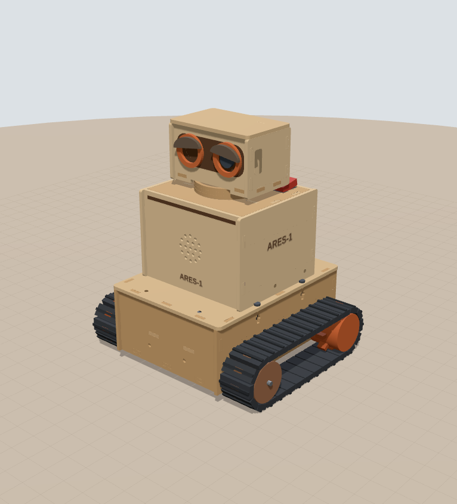

# ARES-1 工程設計書 · 主版本 B（直立式、頭可轉、雙履帶）

> 一句話：把兩顆 64 mm 長的馬達「一前一後斜對角」塞進 110 mm 寬的底盤，底盤做成雙層巴士——
> 下層是馬達和電路，上層整層是學員自備行動電源的「床」，從車尾推進去、長的可以露出尾巴。
> 一顆 13 g 的伺服只負責「轉」、不負責「扛」。直立式的角色感留給頭和身體，穩定性交給底盤。

> 整台車是 **3 mm 椴木合板雷切＋白膠**，46 片、30 × 45 cm 兩張板（3 台一起排 5 張），零 3D 列印（切法與組裝見 [`LASER.md`](LASER.md)）。



| 項目 | 數值 | 狀態 |
|---|---|---|
| 外形 W × L × H | 179 × 160 × 207 mm | 設計值 |
| 結構 | 3 mm 椴木合板 46 片，榫接＋白膠；一台兩張 30 × 45 cm 板（3 台 5 張） | 設計值 |
| 估計重量 | 約 955 g（含 10000 mAh 薄型行動電源 215 g；合板約 260 g） | 估計 |
| 重心高度 | 60.7 mm（總高 29%） | 估計 |
| 翻覆角 前／後／側 | 42.8° ／ 42.3° ／ 55.7° | 估計 |
| 電源 | 學員自備 PD 行動電源 → CH224K 誘騙 9 V → DRV8870＋Mini560 5 V | 設計值 |
| 續航 | 約 5.4 h（10000 mAh、平均 5.8 W） | 估計 |
| 離地間隙 | 11.0 mm（側壁下緣） | 設計值 |
| 頭部轉角 | ±45°（機械限位 ±55°） | 設計值 |
| 鏡頭 | 在右眼，離地約 184 mm，俯角 10° | 設計值 |
| 履帶 | 廠商套件（可拼接）；模型暫用節距 12.5、寬 30、每邊 28 節 | 待量測 |

互動式 3D 模型：`web/index.html`（直接用瀏覽器開，需要網路載入 Three.js）。
雷切檔：`laser/`（預設參數的 SVG／DXF），或在網頁「雷切」分頁改板厚、切縫、板材大小後直接下載。
3D 列印版（`cad/`、`PRINTING.md`）保留當備案，幾何是改木板之前的版本。

尺寸標記：**[C] 已確認**（你提供的或商品圖）、**[E] 估計**、**[M] 待量測**、**[D] 設計值**（我選的，可以改）。

### 目前已依實物資料更新的零件

| 零件 | 從照片確認的事 |
|---|---|
| GOOUUU ESP32-S3-CAM（N16R8） | 2 × 20 排針絲印、OTG＋TTL 兩個 USB-C 在同一端、板載 WS2812、天線突出 PCB 約 4 mm、**相機是軟排線接的，平常貼在模組鐵殼上，偏天線端約 20 mm** |
| JGA25-370 | **6 V 版**、軸根 Ø7 銅套、D 切面 3.5、M3 孔距 17、編碼器 6P 接頭在編碼器蓋側面 |
| DRV8870 雙路模組 | 端子 VM G OUT1–4 在一條長邊、排針 IN1–4 VO G S1 G S2 G 在另一條長邊、板上 LM317M 可調輸出 VO、0.1 Ω 取樣電阻 |
| MAX98357A | 腳位 LRC BCLK DIN GAIN SD GND Vin，上方兩孔距 12.6、孔心到底邊 16.7 |
| INMP441 | 10 × 10，腳位 L/R WS SCK｜GND VDD SD，收音孔在元件面（金屬殼上） |
| SG92R | 23.2 × 12.1 × 22.7、耳片跨距 32.1、含軸總高 30.5、含線約 13 g |

---

## 0. 常見問題（先回答你問的）

### 3D 列印太貴，改成木板雷切可以嗎？

**可以，而且整台車都改成雷切了。** 3 mm 椴木合板榫接＋白膠，46 片、30 × 45 cm 兩張板，雷射約 30 分鐘。
列印最貴的其實不是線材，是**機器時間**：一台車要印十幾到二十幾小時，十台就是一台印表機印一週；雷切一個下午切完全部。

改成木板時重新設計的地方：

| 原本（列印） | 現在（合板） | 為什麼 |
|---|---|---|
| 一體成形底盤槽 | 底板＋左右側壁＋前後壁榫接成箱子，側壁在最外層兼馬達座 | 平板只能做「箱子」，馬達孔、惰輪長槽都直接切在側壁上 |
| 4 根立柱＋熱熔螺母 | 側壁頂邊 4 個 **T 型槽**（M3 螺帽塞進橫槽），上身底板從上面鎖 | 雷切木作的標準鎖法，不用烙鐵 |
| 列印托盤＋M2.5 自攻 | 合板托盤，前端榫頭插前壁、後端落在後壁開口，**不上膠不鎖** | 要修下層的線，抬起來就拿出來 |
| 喇叭墊高環 | 喇叭直接黏在外殼前板背面 | 前板就是音箱面板，少一個零件 |
| 頸座軸環（一體） | 兩片合板環疊黏在頂板上，對位圓用雷射淺劃 | 木頭磨木頭：砂紙磨順＋抹蠟 |
| 頭罩＋後蓋（PETG） | 四面牆＋底板榫接；上蓋＋定位板直接卡進去，不用螺絲 | 臉上的護目鏡用雷雕，眼睛是黏上去的小件 |
| ESP32 角座 | 兩片卡板，PCB 兩端卡進十字孔 | 十字孔中間讓出 USB 與天線 |
| 列印履帶與鏈輪 | 廠商履帶套件 | 營隊已經買了 |

雷切檔是**從 3D 模型直接產生**的：每個榫頭穿過哪一片板，程式就在那片板上挖榫孔（每邊留 0.05 mm），再加上切縫補償、真實形狀排版（小零件塞進大零件的孔和缺口）、文字轉外框。
改任何參數（包括實測板厚），模型、檢查、雷切檔一起變。網頁「檢查 → 製造」會確認每個榫頭都有榫孔、孔不會破邊、孔跟孔不會黏在一起，並把 46 片板在 3D 裡每 2 mm 掃一次，確認沒有兩片佔到同一個空間（這一步抓到了頭部裙邊撞到前後牆下緣，已經在牆下緣挖缺口解決）。

### 新電源方案（PD 行動電源 → CH224K 9 V）可行嗎？

**可行，而且比 2S 18650 更適合營隊**：不用管鋰電池充電與保護板，學員帶自己的行動電源就好。但有 5 件事一定要做對：

| # | 風險 | 做法 |
|---|---|---|
| 1 | CH224K 板子出廠常設 **20 V 或 12 V** | 上車前先單獨接行動電源，三用電表量到 **9.0 V** 才接（設定方式要看你那塊板子：跳線、電阻或撥碼）[M] |
| 2 | 行動電源不支援 PD、或用了 A-to-C 線 → 只有 5 V | DRV8870 要 ≥ 6.5 V 才會動。GPIO1 量 9 V 匯流排，**< 7 V 就停車、亮紅燈、序列埠提示「PD 沒成功」** |
| 3 | 20 W 上限（9 V 最多 2.2 A） | 平常約 6 W 沒問題；最壞（兩邊堵轉＋伺服堵轉＋喇叭大聲）約 25 W。驅動板可變電阻轉最小（限流約 1.25 A）＋ PWM 上限 66 % ＋ **編碼器堵轉保護 0.3 s 斷電** |
| 4 | 行動電源電流太小會自動關機 | ESP32＋相機平常 9 V 端約 0.1 A，勉強在門檻上。韌體不用 deep sleep；真的被關掉就按一下行動電源 |
| 5 | 馬達是 6 V | 9 V × PWM 66 % ≈ 6 V；0.25 s 軟啟動。韌體 `MOTOR_MAX = 0.66`，不要拿掉 |

另外兩個重要修正：

- **編碼器的 3.3 V 改用 AMS1117-3.3**（從 Mini560 的 5 V 降）。DRV8870 模組的 VO 很可能就是晶片的 VREF（限流設定）：0.1 Ω 取樣下限流 ≈ VO ÷ 1 Ω，LM317M 最低 1.25 V → 最低 1.25 A。所以 **VO 不要拿去接任何東西，可變電阻轉到最小**（最安全的限流）。這點等板子回來用三用電表確認 [M]。
- **9 V 側加 C1 1000 µF／25 V**，並在 DRV8870 的 VM／G 端子上。馬達啟動、反轉的電流尖峰會讓行動電源以為短路而斷電，這顆電容幫它擋掉。

### 行動電源要放哪？掛在外面不是比較好換嗎？

我在模型裡兩種都算了（網頁「參數 → 行動電源 → 掛背後（比較用）」可以直接切）。同一顆 10000 mAh 薄型、總高相同：

| | **放電池艙（主方案）** | 掛在身體背後 |
|---|---|---|
| 重心高 | **60.7 mm** | 72.3 mm（＋12） |
| 重心前後 | 幾乎在兩軸中間（−0.5 mm） | 往後 15.7 mm |
| 急加速後仰門檻 | **8.9 m/s²** | 5.4 m/s² |
| 履帶最大抓地 μg | 6.9 m/s² | 6.9 m/s² |
| 結果 | 抓地力先打滑，不會翻 | **猛加速或上坡會往後翻**（後翻角 29.0°，比打滑角 35° 還小） |

掛背後唯一的好處是好拿，但重心又高又偏後，還會擋住外殼拆裝。**電池艙其實一樣好換**：拔線、撕開魔鬼氈、往後抽，不用拆任何東西。

### 每個學員的行動電源都不一樣大，怎麼辦？

把底盤想成**雙層巴士**：下層是馬達、驅動板、電源區；上層整層都是行動電源的「床」。

- **寬 85 mm × 高 27.5 mm 以內都放得進去**（左壁凸緣到右緣立板 85、托盤到上身底板 28）。市售 5000–20000 mAh 幾乎都在這個範圍。
- **長度不限：後面整個打開（開尾）**。電池艙長 152 mm，比較長的直接從車尾露出來；離去角在露出 40 mm 內都還有 36° 以上，營隊坡道 ≤ 20° 沒問題。
- **太薄**：兩條 20 mm 背對背魔鬼氈穿過托盤側邊的扣孔拉緊。
- **太短**：前面塞合板疊片（3 mm 一片可疊，或一塊泡棉），把它推回中間。網頁「檢查 → 行動電源前後位置」會算建議長度。

| 常見行動電源（典型值） | 外形 | 重量 | 重心高 | 建議前方墊塊 | 續航 |
|---|---|---|---|---|---|
| 5000 mAh 小型 | 98 × 63 × 15 | 120 g | 62.1 mm | 約 20 mm | 約 2.7 h |
| 10000 mAh 方塊 | 105 × 66 × 25 | 200 g | 62.1 mm | 約 20 mm | 約 5.4 h |
| **10000 mAh 薄型（預設）** | 148 × 70 × 15 | 215 g | 60.7 mm | 不用 | 約 5.4 h |
| 20000 mAh 大容量 | 155 × 74 × 27 | 420 g | 60.7 mm | 不用（尾巴露出 3 mm） | 約 10.8 h |

自己那一顆不在表上？網頁「參數 → 行動電源」直接輸入長寬厚和重量，所有檢查會即時重算。

**行動電源的條件**：支援 USB PD、背面標示有 **9V⎓2A**（或寫 18 W／20 W 以上）、有 **C 孔輸出**。只有 A 孔、或只有 5 V 的不能用。

### 怎麼換行動電源？

1. 關掉頂板上的開關。
2. 拔掉車尾的 USB-C 短線。
3. 撕開兩條魔鬼氈。
4. 行動電源直接往後抽出來，換一顆推到底、綁好、插線。

整個過程**不用拆外殼、不用拆頭、也不用把車翻過來**。不想拔也可以：輸入孔朝後放，直接插充電器在車上充。
網頁「顯示 → 換行動電源示範」會把這個動作跑給你看。

### SG92R 夠力嗎？要不要換 MG996R？

**SG92R 夠，而且比 MG996R 更適合。**

- 頭部（合板頭殼＋底盤＋ESP32＋麥克風＋線）約 70 g，轉動慣量約 50 kg·mm²。
- 就算用 SG92R 最快的速度（0.1 s／60°）急轉急停，只需要約 21 mN·m；SG92R 在 4.8 V 約 245 mN·m，**安全係數約 12 倍**。
- 頭的重量和撞擊由頂板的軸環／頭部裙邊承受，伺服軸只負責轉，不會被壓歪。

MG996R 反而是負擔：55 g（重心變高）、堵轉電流約 2.5 A（20 W 行動電源更吃緊、ESP32 容易重開機）、尺寸大到頸部要重畫，而且便宜版常有抖動。
MG996R 可以留給未來真的要扛東西的手臂。

### 一顆伺服需要伺服驅動板嗎？

**不需要。** ESP32-S3 的 LEDC 可以直接輸出 50 Hz PWM，SG92R 吃 3.3 V 訊號沒問題。只要注意：

- 伺服的電源（紅線）接配電板的 5 V，**不要**從 ESP32 的 5V 腳取電。
- 伺服的地（棕線）和 ESP32 共地。
- 訊號（橘線）接 GPIO2。

LU9685 這類 16 路 PWM 板是給「很多顆伺服」或「沒有 PWM 腳」的情況，這台車用不到。

### 馬達的霍爾編碼器要接回 ESP32-S3

可以，而且值得：有了速度回授，兩邊履帶可以跑一樣快，車子才走得直；新電源方案還要靠它做堵轉保護。做法見第 7.3 節，重點是：

- **A 相先接**：左馬達 → GPIO19、右馬達 → GPIO20（OTG 口的腳位，所以改用 TTL 口燒錄）。方向用馬達指令判斷就好。
- **B 相選配**：GPIO3、GPIO46。GPIO46 在燒錄時必須是低電位，燒不進去時拔掉 J2 或把輪子轉一下。
- **編碼器一定要吃 3.3 V**：ESP32-S3 的腳位不耐 5 V。由 AMS1117-3.3 供電，每條訊號線再串 1 kΩ。

---

## 1. 三種直立式配置，為什麼選 B

| | A 同軸後置 | **B 對角馬達（主方案）** | C 長頸桅杆 |
|---|---|---|---|
| 馬達擺法 | 兩顆都在車尾、同一軸線對頂 | 左馬達在後、右馬達在前，前後錯開 | 同 B |
| 兩馬達干涉 | 內寬 110 會**重疊 18 mm**，要加寬到 ≥ 132 | **完全錯開**，最近距離 86.5 mm | 同 B |
| 整車寬 | 205 mm | **181 mm** | 181 mm |
| 重心 | 偏後 8 mm | 前後平衡（z 偏移 −0.6 mm） | 高 10 mm（71.6 mm） |
| 換行動電源 | 電池艙同 B，但車尾下層被馬達佔滿，USB-C 只能接到前面 | **車尾抽出，長的可以露出尾巴** | 同 B |
| 頭部 | 同 B | 線束最短、最穩 | 桅杆會晃、線束多 70 mm |
| 鏡頭 | 同 B | 離地 182 mm | 離地 252 mm，看得最遠 |
| 結論 | 不選 | **主方案** | 備選：比賽需要看遠時再用 |

C 其實不會翻（翻覆門檻 7.6 m/s² 仍大於抓地力 6.9 m/s²），但安全餘裕從 27% 掉到 10%，而且頭部多一根 70 mm 的槓桿，每次急停都會點頭。

網頁「參數 → 配置方案」可以切換 A/B/C，A 在 110 mm 內寬時會直接亮紅色干涉。

---

## 2. 分層與高度

座標：X＝車子左側、Y＝向上、Z＝車頭方向，原點在地面中心。

| 層 | 高度範圍 (mm) | 內容 |
|---|---|---|
| 底盤下層 | 0 – 37.5 | 履帶、底盤箱（合板榫接）、兩顆 JGA25-370、DRV8870＋C1、電源區（CH224K、Mini560、AMS1117） |
| 底盤上層（電池艙） | 37.5 – 70 | 托盤、行動電源、魔鬼氈；右側線材通道與 J1/J2；上身底板 |
| 身體層 | 71.5 – 149.5 | 上身骨架、外殼套筒（高 78）、喇叭、MAX98357A、配電板、開關、SG92R |
| 頭部層 | 149.5 – 207 | 頸座軸環、頭部底盤、頭殼、上蓋、ESP32-S3-CAM、INMP441 |

關鍵高度：軸心 24.2、馬達頂 36.7、履帶頂 48.5；側壁下緣 11.0、底板 14–17、托盤 37.5–40.5、電池艙 40.5–68.5、上身底板 68.5–71.5；
身體 71.5–149.5；伺服底 128.1、舵盤頂＝頭部底板底 159.0、鏡頭中心 184.0、頭頂 207.0。

為了讓出 28 mm 的電池艙，身體從 96 縮成 78 mm，**總高不變**。降壓模組搬到底盤電源區，身體裡反而更空。

---

## 3. 底盤層

### 3.1 履帶與輪子（廠商套件）

營隊已經買了履帶套件：履帶是一節一節拼的，長度可以自己加減。模型暫時用「節距 12.5、10 齒驅動輪（節圓 Ø41）、寬 30、軸距 111.5 → 每邊 28 節」算，
**輪徑決定輪軸高度、底盤箱高度和離地間隙**，套件量好之後要改參數（網頁「參數」）再切底盤箱。

要量的：驅動輪外徑（含齒）、齒數、輪寬、中心孔（圓／D 形／六角、幾 mm）；惰輪外徑、寬、中心孔；履帶節距（量 10 節 ÷ 10）、寬、厚。
驅動輪中心孔不是 Ø4 D 形的話，用聯軸器或法蘭轉接到 JGA25-370 的軸。

### 3.2 底盤箱與馬達固定

- 底盤箱是 14 片 3 mm 合板：底板夾在四面牆中間、四邊榫頭插進牆；**左右側壁在最外層**，前後各多 3 mm 包住前後壁，同時是馬達座與惰輪軸座。
- 左馬達在車尾（z = −55.75），右馬達在車頭（z = +55.75）。兩個 M3 孔（孔距 17）**左右（水平）排列**，編碼器 6P 接頭水平朝車身中央（上面 0.8 mm 就是托盤）。
- 用 **M3 × 6 圓頭** 從側壁外面鎖，穿過 3 mm 合板後進入減速箱約 3 mm。軸根 Ø7 銅套凸台坐進側壁 Ø8.4 軸孔。
- 馬達尾端靠在兩片合板托柱上，束線帶綁住。底板在馬達正下方開缺口，讓馬達低到「軸高 − 半徑」。
- 側壁比底板往下多 3 mm（底板的榫頭才插得進側壁），所以離地間隙是 11.0 mm，由側壁下緣決定。

### 3.3 上身怎麼鎖在底盤上：T 型槽

側壁頂邊有 4 個 T 型槽（左右各 2，z = ±30）：豎槽 3.4 寬、13 深，中間一條 5.8 × 2.6 的橫槽放 M3 螺帽。
上身底板（比側壁外面再寬 2.5 mm）從上面用 **M3 × 12** 鎖下來咬住螺帽。螺帽比 3 mm 板寬，會凸出側壁兩面一點點，這是正常的。

### 3.4 電池艙（行動電源）

| 項目 | 設計 |
|---|---|
| 托盤 | 3 mm 合板、底面在 37.5（馬達頂 +0.8）；前端兩個榫頭插進前壁，左邊架在凸緣上、右邊靠小立板、後端落在後壁開口下緣。**不上膠不鎖**，抬起來就拿出來 |
| 可用空間 | 寬 85（右緣立板到左壁凸緣）× 高 27.5 × 長 152，**後方不封口** |
| 擋塊 | 前壁就是擋塊；短的行動電源前面塞合板疊片（3 mm 一片）或泡棉 |
| 固定 | 兩條 20 mm 背對背魔鬼氈，扣孔 3 組（z = −55、−10、35），行動電源短的時候用前面兩組 |
| 右緣立板 | 高 8，黏在托盤上，兼行動電源導軌與線材通道的牆 |
| 線材通道 | 右側 16 mm 寬，從地板直通上身底板的 6 × 26 長孔；J1/J2 放在裡面 |
| 後壁 | 上半部整個打開（行動電源進出）；下半部 13.5 × 7.6 孔讓 CH224K 的 USB-C 母座伸出 |

### 3.5 DRV8870 雙路模組

| 項目 | 設計 |
|---|---|
| 位置 | **右側** x = −51 … −21、z = −36 … 12；底板開 4 個 Ø3.2 孔，5 mm 尼龍隔離柱墊高，M3 從底板下面鎖 |
| 孔距 | 40.8 × 22.8（照片標 R3.6 圓角，孔心在圓角中心）[E] |
| 方向 | **藍色端子朝車身中央、VM 在後端（靠電源區）**；排針那一長邊在線材通道正下方，杜邦頭上方有 30 mm 可以往上彎線 |
| 接線 | VM／G ← 9V_SW（並 C1 1000 µF）；OUT1/2 → 右（前）馬達；OUT3/4 → 左（後）馬達；IN1–4 ← J2 |
| VO | **不接任何東西**。很可能就是 VREF（限流）：可變電阻轉到最小 ≈ 1.25 A [M] |
| S1／S2 | 用途待確認（可能是電流取樣輸出），第一版不接 |

控制：IN1 = PWM、IN2 = 0 前進；IN1 = 0、IN2 = PWM 後退；兩腳都 0 滑行、都 1 煞車。

### 3.6 電源區（下層右後角）

| 模組 | 位置 | 說明 |
|---|---|---|
| CH224K 誘騙板 | 右後角，坐在合板墊片上、USB-C 母座從後壁小孔伸出 | 設 9 V；外形約 12 × 25 [M] |
| Mini560 | CH224K 旁邊 | 9 V → 5 V，標示 5 A [E]；固定 5 V 版免調 |
| AMS1117-3.3 | 右側通道下方 | 5 V → 3.3 V，只給兩顆編碼器 |
| C1 1000 µF／25 V | 躺在 DRV8870 端子旁、腳朝後 | 並在 VM／G 上 |

行動電源的 C 孔朝後，用 10–15 cm 的 C-to-C 短線從車尾繞下來插 CH224K。桌上測試時可以直接插 PD 充電頭（20 W 以上）。
底板上雷雕了每個模組的位置框（藍色淺劃線）：先黏 3 mm 合板墊片，再用泡棉雙面膠貼模組（Mini560、AMS1117 多半沒有安裝孔）。

---

## 4. 身體層

- **上身骨架**：上身底板（161 × 121 × 3）兼電池艙上蓋；一片脊板＋兩片側翼用榫頭插進底板和頂板，白膠固定。右後方 6 × 26 長孔對準線材通道。拆 4 顆 M3（T 型槽），上身（含頭）整組拿起，中間只連 J1（電源）、J2（馬達與編碼器訊號）。
- **外殼套筒**：110 × 100 × 78、上下開口，左右側板在最外層、前後板內縮 3 mm（像相框）。側面 4 顆 M3 × 8 鎖進側翼上壓入的六角螺帽。頭 84 × 54、軸環 Ø50、限位柱半徑 33，全在開口之內，**拆外殼不用拆頭**。

| 模組 | 位置 | 固定 |
|---|---|---|
| 喇叭 Ø40 × 20 [E] | 外殼前板背面，對準圓孔格柵 | 熱熔膠黏在前板上（線留 12 cm，外殼才拔得起來） |
| MAX98357A | 喇叭旁，喇叭線 < 8 cm | 上方兩孔 M2（孔距 12.6 [C]） |
| 配電洞洞板 | 右翼內側（SS34、470 µF ×2、9 V 監測分壓、4 顆 1 kΩ 編碼器保護電阻） | 束線帶穿右翼的 4 個小孔 |
| 開關 KCD1 | 頂板左後角，按鈕朝上 | 卡入 19 × 13 開孔 |
| SG92R | 倒吊在頂板下方 | 耳片 2 × M2 自攻 |

⚠ 你的 MAX98357A 商品組合裡附的是**長方形腔體喇叭**。如果你用的是那一顆而不是 Ø40 圓形喇叭，請告訴我尺寸，前板的格柵要改成長方形。

---

## 5. 頭部層（主版本重點）

### 5.1 頭型：右眼就是真鏡頭

GOOUUU 板的 OV2640 不是焊死在板子中間，而是用橘色軟排線接在板子中段的 FPC 座，相機本體平常貼在 WROOM 模組的鐵殼上，
**離 PCB 中心約 20 mm、偏天線那一端**。PCB 橫放在頭裡時，這個位置剛好就是一隻眼睛。

所以頭部設計成一對對稱的眼圈：**右眼的瞳孔就是真的鏡頭**，左眼是合板切的造型瞳孔（塗深灰）。臉上一片深色護目鏡是雷雕出來的。
兩眼上方各有一片可替換的眼瞼，角度就是表情，營隊可以讓學員自己設計。

軟排線的好處：鏡頭和眼圈中心差幾 mm 時，直接把相機模組挪過去，用雙面膠貼好就對準了。
（網頁「鏡頭偏離 PCB 中心」小於 12 mm 時，會自動退回「兩眼都是造型、鏡頭藏在護目鏡中間」的版本。）

### 5.2 旋轉機構：伺服只轉、不扛

```
頭部底板（合板）──┬── 2×M2 ── Ø20 圓舵盤 ── SG92R 花鍵
                  └── 裙邊 3 片疊黏 ID51/OD57（下垂 9）── 套住 ──> 頸座軸環 2 片疊黏 ID42/OD50（高 6）
```

- 伺服從頂板下方塞入，耳片貼頂板底面，只有花鍵凸台露出來。
- 頭的重量由花鍵承受（約 70 g），**側向力與撞擊由軸環／裙邊承受**，徑向間隙 0.5 mm。木頭磨木頭：兩邊都用 400 號砂紙磨順、抹一點蠟。
- 兩根限位柱＋裙邊限位指：軟體 ±45°、**機械限位 ±55°**。
- 裙邊 Ø57 比頭部深度（54）大一點，前面會像下巴一樣露出約 2.5 mm；最上面那片裙邊跟頭殼前後牆的下緣同高，所以前後牆下緣各挖一個缺口讓它通過（3D 互撞檢查抓到的）。
- 組裝時先用測試程式把伺服轉到 90° 再裝舵盤。

### 5.3 線束怎麼過一個被伺服佔住的轉軸

1. 頭部底板在轉軸後方 16 mm 開 Ø8 孔（杜邦頭可以一顆一顆穿）。
2. 頂板同一位置開**腎形窗口**（r = 9 … 20.5，只在 z ≤ −7.5，避開伺服耳片）。
3. 線束現在是 15 芯（加了編碼器），外包螺旋套約 Ø7。頭轉到 ±45° 時線束邊緣在 57.6°，窗口可用到 62.1° → **餘裕 4.4°**。
4. 身體內留 U 形餘長圈。頭轉 ±45° 時線束頂端只橫移約 ±11 mm。

### 5.4 ESP32-S3-CAM 安裝（GOOUUU）

- PCB 橫放、俯角 10°。USB 端朝頭部**左側**、天線端朝**右側**（天線突出 PCB 約 4 mm，右側牆內還有 1.9 mm 空隙）。
- 兩片合板卡板插在頭部底板上，PCB 兩端卡進卡板的十字孔（上下角卡住，中間讓出 USB 與天線）。先把 PCB 塞進兩片卡板，再三個一起插進底板。
- 排針朝後，杜邦頭插好後點熱熔膠。深度預算：鏡頭 11 [M] ＋ PCB 1.6 ＋ 排針 8.5 ＋ 杜邦 14 ＋ 彎線 6 = 41.1，頭內可用 44.5 mm。
- **板上只有一支 GND**（右排最下面）：5V 與 GND 用 24 AWG，麥克風的 GND 從同一點分出來。
- USB：頭殼左側板 9 × 20 mm 開孔，OTG、TTL 兩個 USB-C 都露出來。**用 TTL 口燒錄**（CH340 會自動重置，最穩）。
- 散熱：頭後板 7 道散熱槽；木頭不像 PLA 會在 55 °C 變軟。

### 5.5 麥克風放頭部

| 位置 | 到喇叭 | 到馬達 | 結構振動 |
|---|---|---|---|
| **頭頂內側（預設）** | 109 mm | 181 mm | 和喇叭隔著伺服，不共振 |
| 身體上後方 | 約 104 mm | 約 136 mm | 和喇叭共用外殼，會收到喇叭振動 |

INMP441 的收音孔在元件面（金屬殼上），所以**金屬殼朝上**貼在頭頂 3 個 Ø1.5 小孔下面。排針不要焊，5 條線直接焊在焊盤上比較薄。
轉頭就是「轉耳朵」。網頁可以切回身體版本。

### 5.6 鏡頭視野

OV2640 對角約 66° [M] → 水平約 55°、垂直約 43°。俯角 10° 時正前方地面最近看到約 299 mm；頭轉 0° 與 45° 時畫面都不會拍到車身。

---

## 6. 特別檢查（你點名的 5 項）

| # | 檢查 | 結論 | 數字 |
|---|---|---|---|
| 1 | 兩顆 JGA25-370 是否干涉 | **不干涉** | 對角擺放，前後相距 86.5 mm；馬達尾端離對側側壁 46 mm。同軸擺法在 110 mm 內寬會重疊 18 mm |
| 2 | 頭轉時 ESP32 與線材會不會卡 | **不會** | PCB 在頭內跟著轉；15 芯線束窗口餘裕 4.4°；頭底離身體頂 9.5 mm |
| 3 | 重心是否過高 | **不高** | 重心 60.7 mm，只有總高 29%。行動電源躺在 40.5–55.5 mm、馬達與履帶在 37 mm 以下 |
| 4 | 底盤寬度是否撐得住 | **撐得住** | 側翻角 55.7°；前後翻門檻 8.9–9.1 m/s²，大於履帶最大抓地 6.9 m/s²，會先打滑不會翻 |
| 5 | 換電池與 USB | **方便** | 行動電源從車尾抽出；USB 從頭部左側直接插 |

穩定性算法：把 34 個零件的質量與位置加權求重心；支撐面取履帶外緣（x = ±90.5）與兩輪軸心（z = ±55.75）。
翻覆加速度 = g × 水平距離 ÷ 重心高；履帶最大加速度 ≈ μg（μ = 0.7 [E]）。韌體仍限制加速度（上線測試程式 0 → 全速 0.25 s），因為坡道、推土板、撞牆都會吃掉餘裕。

---

## 7. 配線設計

### 7.1 電源樹

```
學員自備 PD 行動電源（C 孔）
 └─ C-to-C 短線 ─ 後壁 USB-C ─ CH224K 誘騙 9 V ─ J1（9V_RAW）─ 頂板開關 ─ J1（9V_SW）
      ├─ C1 1000 µF／25 V ─ DRV8870 VM（馬達，PWM 上限 66 %；VO 不接、可變電阻最小）
      ├─ Mini560 IN → 5 V ─ J1（5 V × 2 pin）
      │    ├─ AMS1117-3.3 → 兩顆馬達編碼器 VCC
      │    └─ 配電板
      │         ├─ SG92R（旁邊 470 µF）
      │         ├─ MAX98357A VIN（旁邊 470 µF）
      │         └─ SS34 → 頸部線束 → ESP32-S3-CAM 5V 腳（約 4.6 V）
      │                                   └─ 板上 3.3 V → INMP441
      └─ 100k / 33k 分壓 → GPIO1（9 V → 2.23 V；PD 沒成功 5 V → 1.24 V）
GND：配電板單點匯流，底盤經 J1 回 CH224K 負極
```

- J1 改成 **JST-XH 6P：9V_RAW、9V_SW、GND × 2、5 V × 2**（每 pin 約 3 A；9 V 最多 2.2 A 用單 pin）。
- 保險絲改成選配：行動電源本身有過流保護；想加就在 CH224K 輸出串 3 A 自恢復保險絲。
- SS34：插 USB 燒錄時 USB 的 5 V 不會倒灌到 Mini560。
- 韌體：9 V < 7.0 V 停車亮紅（PD 沒成功）、< 8.3 V 亮黃；編碼器 0.3 s 沒脈衝就斷電（堵轉保護）。9 V 不會隨行動電源電量慢慢掉，電量看行動電源自己的燈。

### 7.2 GPIO 分配（GOOUUU ESP32-S3-CAM，已依排針絲印核對）

| GPIO | 排針 | 用途 | 狀態 |
|---|---|---|---|
| 1 | 右 | 9 V 電源監測（ADC1_CH0，PD 有沒有成功） | D |
| 2 | 右 | SG92R 訊號（50 Hz） | D |
| 47 | 右 | 右（前）馬達 → 模組 IN1 | D |
| 38 | 右 | 右（前）馬達 → 模組 IN2 | D |
| 14 | 左 | 左（後）馬達 → 模組 IN3 | D |
| 21 | 右 | 左（後）馬達 → 模組 IN4 | D |
| 39 | 右 | I2S BCLK（麥克風 SCK＋功放 BCLK 共用） | D |
| 40 | 右 | I2S WS（麥克風 WS＋功放 LRC 共用） | D |
| 41 | 右 | I2S DOUT → MAX98357A DIN | D |
| 42 | 右 | I2S DIN ← INMP441 SD | D |
| 19 | 右 | 左馬達編碼器 A（OTG 的 D−） | D |
| 20 | 右 | 右馬達編碼器 A（OTG 的 D+） | D |
| 3 | 左 | 左馬達編碼器 B（選配） | D |
| 46 | 左 | 右馬達編碼器 B（選配，⚠ 燒錄時必須低電位） | M |
| 48 | 右 | 板載 WS2812，當狀態燈 | C |
| 43 / 44 | 右 | TX0 / RX0 → CH340（TTL 口，燒錄與序列埠） | C |
| 4–13、15–18 | 兩排 | 相機（與 ESP32-S3-EYE 相同） | C |
| **35 / 36 / 37** | 右 | **Octal PSRAM，排針上有但絕對不能接** | C |
| 0、45 | 右 | Strapping（BOOT、Flash 電壓），不接 | C |

可用 14 支，用 12 支（含編碼器 A 相）＋選配 2 支。I2S 必須讓麥克風和功放共用 BCLK/WS（同一個 I2S0 全雙工，取樣率相同，建議 16 kHz）才夠。
**不需要 LU9685**：只有 1 顆伺服，ESP32 直接輸出。

### 7.3 霍爾編碼器怎麼接

JGA25-370 的編碼器線是一條 6P（常見：M+、M−、編碼器 VCC、GND、A、B，**每家顏色不同，請拍給我對**）：

| 線 | 接到 |
|---|---|
| M+ ／ M− | DRV8870 OUT（右馬達 OUT1/2、左馬達 OUT3/4） |
| VCC ／ GND | AMS1117-3.3 的 3.3 V ／ GND（都在底盤電源區） |
| A ／ B | J2 → 配電板串 1 kΩ → 頸部線束 → GPIO19/20（A）、GPIO3/46（B） |

- 第一版只用 A 相，用中斷數脈衝（上線測試程式的 `e` 指令），方向取自馬達指令。
- 為什麼要 3.3 V：編碼器板上的上拉電阻接在 VCC，VCC 是 5 V 時 A/B 就是 5 V，會慢慢燒壞 ESP32-S3。**接之前先用三用電表確認 AMS1117 輸出 3.3 V**。
- 6P 接頭現在水平朝車身中央（馬達兩個 M3 孔左右排列），插頭往中間伸，線沿著托盤底下走到右側通道。
- J2 從 4P 升級成 **JST-XH 8P**（PWM × 4 ＋ 編碼器 × 4）。

### 7.4 接線表（走線長度由 3D 路徑量出，剪線請 +40 mm）

| 線 | 從 → 到 | 線材 | 走線長 |
|---|---|---|---|
| USB-C 短線 | 行動電源 C 孔 → 後壁 USB-C（CH224K） | C-to-C，支援 PD 3 A | 97 mm（買 10–15 cm） |
| 9 V 輸出 | CH224K VOUT／GND → J1 | 20 AWG 紅／黑 | 54 mm |
| 9 V 上身（去回） | J1 → 頂板開關（9V_RAW、9V_SW） | 20 AWG | 124 mm |
| 開關後 9 V | J1(9V_SW) → C1 → DRV8870 VM／GND | 20 AWG | 82 mm |
| Mini560 輸入 | C1／VM → Mini560 IN | 22 AWG | 46 mm |
| 5 V 匯流 | Mini560 OUT → J1 → 配電板 | 22 AWG（兩 pin 並聯） | 153 mm |
| 3.3 V 輸入 | Mini560 OUT → AMS1117 | 24 AWG | 53 mm |
| 伺服 | 配電板 3P → SG92R | 原廠線 | 70 mm |
| 功放 | 配電板 → MAX98357A（5V、GND、BCLK、WS、DOUT） | 26 AWG ×5 | 103 mm |
| 喇叭 | MAX98357A → 喇叭 | 24 AWG 雙絞 | 44 mm |
| 右（前）馬達 | DRV8870 OUT1/2 → 6P 接頭 M+／M− | 22 AWG 雙絞 | 66 mm |
| 左（後）馬達 | DRV8870 OUT3/4 → 6P 接頭 M+／M− | 22 AWG 雙絞 | 44 mm |
| 馬達訊號 | 配電板 → J2 → DRV8870 IN1–4 | 26 AWG ×4 | 135 mm |
| 編碼器電源 | AMS1117 3.3 V／GND → 兩顆馬達 VCC／GND | 26 AWG ×2 | 150 mm |
| 左編碼器 | 左馬達 A／B → J2 | 26 AWG ×2 | 86 mm |
| 右編碼器 | 右馬達 A／B → J2 | 26 AWG ×2 | 99 mm |
| **頸部線束** | 配電板 → ESP32 排針（5V、GND、PWM×4、伺服、BCLK、WS、DOUT、9 V 監測、編碼器×4） | 5V/GND 24 AWG＋其餘 26 AWG，15 芯 | 131 mm |
| 麥克風 | ESP32 排針 → INMP441（3V3、GND、SCK、WS、SD） | 28 AWG ×5 | 24 mm |

BCLK 與 WS 在頭內要 Y 型分接（一路到麥克風、一路下頸部到功放）：焊接＋熱縮管。

---

## 8. 拆裝與維修

| 要做的事 | 拆什麼 |
|---|---|
| 換行動電源 | 什麼都不用拆：拔線、撕魔鬼氈、往後抽 |
| 充行動電源 | 什麼都不用拆：輸入孔朝後的話直接插充電器 |
| USB 燒錄 | 什麼都不用拆：頭轉正，插左側 TTL 口（先關電源開關） |
| 看頭內接線 | 頭上蓋直接拔起來（定位板卡在四面牆裡，沒有螺絲） |
| 看身體內部 | 外殼側面 4 顆 M3，套筒往上拔 |
| 換驅動板、馬達、電源模組 | 再拆上身底板 4 顆 M3（T 型槽），抬起一點拔 J1/J2，整個上身拿起來；拿出行動電源，托盤後端抬起來往後抽 |
| 換履帶 | 照套件方式拆節；惰輪 M4 放鬆就能把履帶拿下來 |
| 某一片合板壞了 | 網頁「雷切」只重切那一片（零件清單有編號），幾十秒 |

---

## 9. 尺寸狀態總表

| 元件 | 項目 | 數值 (mm) | 狀態 |
|---|---|---|---|
| JGA25-370 | 本體 Ø25（馬達罐 Ø24.2）／馬達段 31／編碼器蓋 11 | — | C |
| JGA25-370 | 輸出軸 Ø4、突出 12.5、D 切面 3.5、M3 孔距 17 | — | C |
| JGA25-370 | 軸根銅套 Ø7 × 約 2.5 | — | E |
| JGA25-370 | 額定電壓 | 6 V | C |
| JGA25-370 | 減速箱長 L（依減速比）、6P 腳位 | 22 | E ／ M |
| ESP32-S3-CAM | GOOUUU N16R8，PCB 62.6 × 28.3，排針 2 × 20、列距 24.7 | — | C |
| ESP32-S3-CAM | OTG＋TTL 同一端（中心 ±5.6）、WS2812 在 GPIO48 | — | C |
| ESP32-S3-CAM | 天線突出 PCB | 4.3 | E |
| ESP32-S3-CAM | 鏡頭偏離 PCB 中心（軟排線，可調） | −20 | M |
| ESP32-S3-CAM | 鏡頭高出 PCB、背面有無 TF 卡座 | 11 ／ — | M |
| MAX98357A | PCB 17.7 × 19.1、上方孔距 12.6、孔心到底邊 16.7、腳位 | — | C |
| INMP441 | 10 × 10、6 腳、收音孔在元件面 | — | C |
| DRV8870 雙路 | 48 × 30、Ø3 孔、端子與排針排列、LM317M | — | C |
| DRV8870 雙路 | 孔距 | 40.8 × 22.8 | E |
| DRV8870 雙路 | VO 是否＝VREF（限流）、S1／S2 用途 | — | M |
| SG92R | 23.2 × 12.1 × 22.7、跨距 32.1、總高 30.5、約 13 g | — | C |
| SG92R | 耳片下緣高、軸心到本體端、耳片孔距 | 15.9 ／ 5.9 ／ 27.8 | E |
| 行動電源（學員自備） | 外形／重量（預設 10000 mAh 薄型） | 148 × 70 × 15 ／ 215 g | M |
| 電池艙 | 可用寬 × 高 × 長（尾端開放） | 85 × 27.5 × 152 | D |
| CH224K 誘騙板 | 外形、9 V 設定方式 | 約 12 × 25 ／ — | M |
| Mini560 | 外形、固定 5 V 或可調 | 22 × 17 ／ — | E ／ M |
| AMS1117-3.3 模組 | 外形 | 22 × 11 | E |
| C1 | 1000 µF／25 V | Ø10 × 20 | E |
| 喇叭 | 圓形 Ø40 × 20 還是長方形腔體 | — | M |
| 履帶套件 | 驅動輪外徑、齒數、中心孔；履帶節距、寬 | 模型暫用 Ø41、10 齒、12.5、30 | M |
| 椴木合板 | 實際板厚（「3 mm」常是 2.7–3.2） | 3.00 | M |
| 雷切機 | 切縫寬、平台大小 | 0.15 ／ 400 × 300 | M |
| 其他 | 所有合板件尺寸 | 由網頁參數產生（`laser/parts.csv`） | D |

---

## 10. 風險結構

| 等級 | 風險 | 對策 |
|---|---|---|
| 高 | 急煞前翻／急加速後仰 | 行動電源躺在馬達正上方當配重；韌體加速度限制；換大顆行動電源、加推土板或加高頸部後重看「檢查」 |
| 高 | 頸部線束疲勞斷線 | 線束在轉軸後方 16 mm；U 形餘長；機械限位 ±55°；杜邦頭熱熔膠 |
| 高 | CH224K 輸出不是 9 V（出廠常是 20 V） | 上車前單獨量到 9.0 V 才接 |
| 高 | PD 沒成功（只有 5 V）或行動電源自動關機 | 一定用 C-to-C 線；GPIO1 監測 < 7 V 停車亮紅；韌體不用 deep sleep |
| 高 | 編碼器 5 V 燒壞 GPIO | 編碼器只吃 AMS1117 的 3.3 V＋每條 1 kΩ；驅動板 VO 不接 |
| 中 | 20 W 上限：兩邊堵轉＋伺服＋喇叭會超過 | 驅動板可變電阻最小（約 1.25 A）、PWM 上限 66 %、編碼器堵轉保護 0.3 s |
| 中 | 6 V 馬達接 9 V | PWM 上限 66 %（平均約 6 V）、0.25 s 軟啟動 |
| 中 | 每個學員的行動電源不一樣 | 電池艙 85 × 27.5、尾端開放；魔鬼氈＋前方墊塊；網頁先輸入尺寸檢查 |
| 中 | 伺服／喇叭瞬間電流讓 ESP32 重開 | Mini560；伺服、功放旁各 470 µF；ESP32 經 SS34 獨立一路；9 V 端 C1 1000 µF |
| 中 | GPIO46（編碼器 B）影響燒錄 | 先只接 A 相；接 B 相後燒錄失敗就拔 J2 |
| 中 | 接到 GPIO35/36/37 | 這三支是 PSRAM，接線表與排針貼紙標明「不可用」 |
| 中 | 套件驅動輪的孔不合 Ø4 D 軸 | 先量中心孔；不合就用聯軸器／法蘭轉接 |
| 中 | 榫接太緊或太鬆 | 每批板子先切測試片校正板厚、切縫、間隙（`LASER.md` 第 2 節） |
| 中 | 頭內發熱 | 頭後板散熱槽、串流降解析度 |
| 中 | 減速箱 M3 螺絲過長頂到齒輪 | M3 × 6 圓頭，穿過 3 mm 合板後進入約 3 mm |
| 低 | 合板受潮翹曲 | 組好後塗一層水性透明漆或蠟；不要放在大太陽下的車裡 |
| 低 | 離地 11.0 mm | 室內場地；障礙物 ≤ 15 mm |
| 低 | 長行動電源尾巴露出 | 露出 40 mm 內離去角仍 ≥ 36°；倒車撞牆時尾巴先撞 |
| 低 | I2S 共用時脈 | 麥克風與喇叭同取樣率（16 kHz） |

---

## 11. 還需要你補的

1. **學員的行動電源**：請收集大家手上那顆的長 × 寬 × 厚、重量，以及背面有沒有「9V⎓2A」或 20 W 標示。越多筆越好，我可以再微調電池艙。
2. **CH224K 誘騙板**：拍正反面，看它怎麼設定 9 V（跳線、電阻還是撥碼），以及外形尺寸。
3. **Mini560**：拍正反面，確認是固定 5 V 還是可調、外形尺寸。
4. **DRV8870 模組**：板子回來後量 VO（轉可變電阻看是不是從 1.25 V 起跳），並拍背面確認 VO 是否接到 DRV8870 的 VREF、S1／S2 接哪裡。
5. **ESP32-S3-CAM**：鏡頭中心到天線端 PCB 邊的距離（目前估 11 mm → 偏移 −20）、鏡頭頂高出 PCB 多少、背面有沒有 TF 卡座。
6. **JGA25-370**：減速比（決定減速箱長 L），以及 **6P 編碼器線每一條的顏色或絲印**。
7. **SG92R**：卡尺量耳片下緣到底部、軸心到本體端。
8. **喇叭**：Ø40 圓形，還是商品圖裡的長方形腔體喇叭？（尺寸、阻抗、功率）
9. **履帶套件**：驅動輪／惰輪外徑、齒數、寬、中心孔；履帶節距、寬。輪徑決定底盤箱高度，量好再切底盤箱。
10. **雷切機**：平台大小、瓦數、用什麼軟體（LightBurn、RDWorks…）。我可以把排版改成剛好塞滿你們的平台。

---

## 12. 製造清單

**先切 `laser/ARES1_test.svg` 測試片，量好板厚與切縫，再切正式板。** 雷切設定、上膠位置、常見問題見 [`LASER.md`](LASER.md)。

### 12.1 雷切件（3 mm 椴木合板，46 片）

| 字頭 | 組件 | 片數 | 合板重量 |
|---|---|---|---|
| C | 底盤箱：底板、左右側壁、前後壁、托盤凸緣、小立板、4 根托柱、3 片電源墊片 | 14 | 約 73 g |
| T | 電池艙托盤＋右緣立板 | 2 | 約 20 g |
| B | 上身骨架：上身底板、脊板、左右側翼 | 4 | 約 57 g |
| N | 頂板／頸座：頂板、2 片軸環、2 根限位柱 | 5 | 約 15 g |
| S | 外殼套筒：左右側板、前板、後板 | 4 | 約 52 g |
| H | 頭：底板、3 片裙邊、四面牆、2 片 ESP32 卡板、眼圈 ×2、瞳孔、眼瞼 ×2、上蓋、定位板 | 17 | 約 44 g |

30 × 45 cm 板一台 2 張；**3 台一起排 5 張**（利用率約 79 %），營隊 10 台＝3 組＋1 台＝17 張。雷切＋雕刻一台約 30 分鐘（40 W 粗估）。
每片的編號、尺寸、在哪一張見 `laser/parts.csv`；改參數後在網頁「雷切」分頁重新下載。

### 12.2 採購件

JGA25-370 6 V（含霍爾編碼器）×2、GOOUUU ESP32-S3-CAM ×1、MAX98357A ×1、INMP441 ×1、DRV8870 雙路模組 ×1、SG92R ×1、
CH224K PD 誘騙板（設 9 V）×1、Mini560 5 V 降壓 ×1、AMS1117-3.3 模組 ×1、C-to-C 短線 10–15 cm（支援 PD 3 A）×1、喇叭（4 Ω／8 Ω 3 W）、KCD1 船型開關。
行動電源由學員自備（PD 20 W 以上、有 C 孔）。

### 12.3 電子小零件與五金

1000 µF／25 V ×1（C1）、SS34、470 µF／16 V ×2、100 kΩ＋33 kΩ、**1 kΩ ×4**、100 nF、JST-XH 6P／**8P** 各一組、5 × 7 洞洞板、20 mm 背對背魔鬼氈約 50 cm、
M3×6 圓頭（ISO 7380）×4（馬達）、M3×12＋M3 螺帽 ×4（上身→側壁 T 型槽）、M3×8＋M3 螺帽 ×4（外殼→側翼）、M3×10＋螺帽＋5 mm 尼龍隔離柱 ×4（DRV8870）、
M2×6 自攻 ×4（伺服耳片、舵盤）、M2×8＋螺帽 ×2（功放）、M4×40＋防鬆螺帽 ×2（惰輪軸，看套件）、杜邦母母線 20 cm ×24、20／22／24／26 AWG 矽膠線、熱縮管、3 mm 束線帶、螺旋纏線管。

木工：白膠（樹脂膠）、快乾膠（螺帽）、240／400 號砂紙、紙膠帶或橡皮筋、蠟燭一小截（頸部潤滑）、泡棉雙面膠。

---

## 13. 組裝步驟

網頁「組裝」分頁有 16 步動畫；哪裡上膠、哪裡不要上膠見 [`LASER.md`](LASER.md) 第 5 節。重點：

1. **雷切、清點、乾配底盤箱**：先切測試片校正，再切正式板。每個組件都先乾配，對了再上膠。
2. **裝馬達（對角）**：左馬達靠車尾、右馬達靠車頭；M3×6 圓頭從側壁外面鎖；尾端托柱＋束線帶。
3. **裝驅動輪與惰輪（套件）**：孔不合就用聯軸器；惰輪 M4 放進長槽先不鎖緊。
4. **DRV8870 與 C1**：5 mm 尼龍柱、端子朝車身中央、VM 在後。**可變電阻轉到最小、VO 不接**。
5. **電源區與 J1/J2**：⚠ **CH224K 先單獨接行動電源量到 9.0 V**；模組照底板的雷雕框貼。
6. **拼履帶**：惰輪往外推到「手指壓下去約 5 mm」，鎖緊 M4。
7. **托盤**：線壓低整理好，托盤前端插進前壁、後端放下，不上膠；魔鬼氈穿過長孔。
8. **上身骨架與功放**：脊板、側翼黏在上身底板；側翼壓入 M3 螺帽。
9. **配電板**：束線帶綁在右翼。
10. **頂板**：軸環、限位柱黏好；伺服先轉 90° 再裝；開關壓入；試轉頭沒問題再把頂板黏上骨架。
11. **頭部底盤**：三片裙邊黏好、磨順、抹蠟；舵盤鎖上、朝正前方套上花鍵。
12. **ESP32、麥克風、頭殼**：PCB 先塞進兩片卡板再插上底板；四面牆上膠；相機挪到右眼後面；眼睛黏上。
13. **頸部線束與上蓋**：手動轉頭 ±45° 確認線束沒有被拉緊；上蓋卡上去。
14. **上身合體、套外殼**：J1、J2 插好，4 顆 M3×12 鎖 T 型槽；外殼套筒從頭上往下套，4 顆 M3×8。
15. **放進行動電源**：推到底（短的先放墊塊）、C 孔朝後、魔鬼氈綁緊、接 C-to-C。
16. **通電測試**（`firmware/ares1_bringup`，用 TTL 口燒錄）：先量不短路 → 9 V → 5 V／3.3 V → 伺服 → 馬達 → 編碼器 → 喇叭 → 麥克風 → 地面測試。

---

## 14. 之後可以延伸的

- **任務模組**：前壁 2 × M3（間距 40）＋底板前緣 2 × M3（間距 60）已預留，網頁可開「推土板預覽」。
- **編碼器 B 相與 PCNT**：接上 GPIO3/46 後改用 ESP32-S3 的 PCNT 硬體計數，得到正反轉方向。
- **副版本：低重心履帶車**：同一個底盤箱＋電池艙，身體降到 40 mm、頭裝在前緣。參數化模型改 `bodyH`、`neckZ` 就能開始，雷切檔會跟著重排。
- **電量顯示**：PD 行動電源的 9 V 不會隨電量下降，想在 App 上看電量要另外接行動電源的 I2C（多數不支援），目前以行動電源本身的燈為準。
