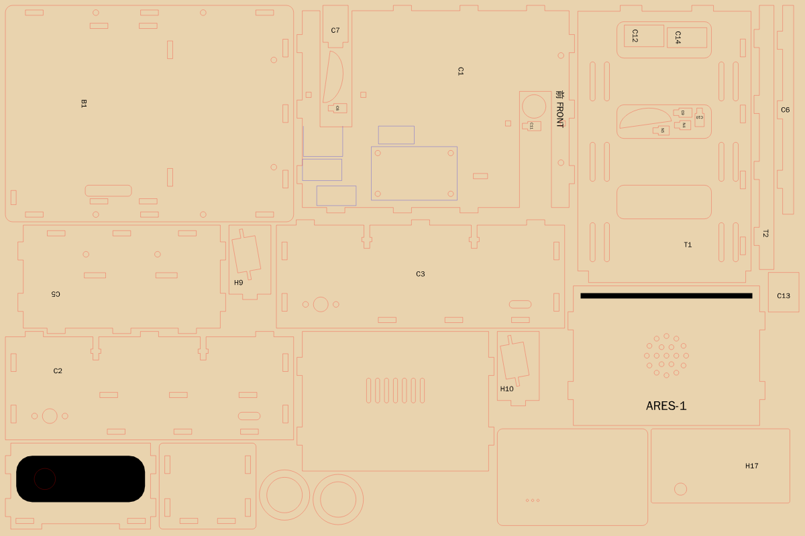
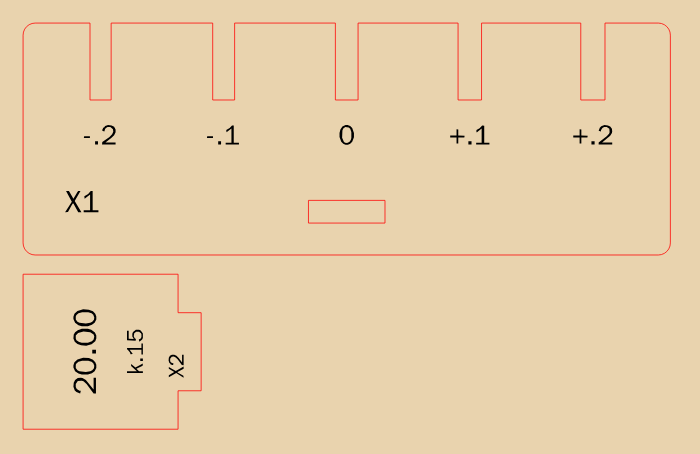

# ARES-1 雷切與組裝指南（3 mm 椴木合板）

> 一句話：整台車是 **46 片 3 mm 椴木合板**，榫頭插榫孔＋白膠，**零 3D 列印**。
> 30 × 45 cm 的板子切 **2 張**就夠一台；**3 台一起排只要 5 張**。雷射一台大約 **30 分鐘**。
> 履帶和輪子用廠商套件，木板只負責「箱子」。

---

## 0. 為什麼改成雷切

| | 3D 列印（舊版） | 雷切合板（現在） |
|---|---|---|
| 材料 | PLA／PETG 約 370 g（約 1/3 卷） | 3 mm 椴木合板 30 × 45 cm × 2 張（3 台一起 5 張） |
| 機器時間／台 | 一台車要印十幾到二十幾小時（估） | 雷切＋雕刻約 30 分鐘（40 W 粗估） |
| 10 台營隊 | 一台印表機要印一週以上 | 一個下午切完 |
| 印壞／切壞 | 大件印到一半失敗，整件重來 | 只重切那一片，幾十秒 |
| 改設計 | 改 CAD → 重切片 → 重印好幾小時 | 網頁改參數 → 下載 → 重切 |
| 重量 | 結構件約 350 g | 結構件約 260 g（車子輕了約 90 g） |

價格請以你們的實際報價為準：合板一張大約幾十元；學校雷切機通常只算時間或免費。
真正省的是**機器時間**：列印是「一台車一整天」，雷切是「一台車一節課」。

---

## 1. 檔案在哪裡

| 檔案 | 用途 |
|---|---|
| `laser/ARES1_test.svg`／`.dxf` | **切縫測試片**，每換一批板子先切這個（約 12 × 4 cm） |
| `laser/ARES1_450x300_sheet1of2.svg`、`sheet2of2` | 30 × 45 cm 板子，**一台 2 張** |
| `laser/ARES1x3_450x300_sheet1of5.svg` … `sheet5of5` | 30 × 45 cm 板子，**3 台一起排 5 張**（最省） |
| `laser/parts.csv` | 零件編號、名稱、尺寸、在哪一張 |
| 網頁「雷切」分頁 | 改板厚、切縫、板材大小、一次排幾台、名牌文字後**即時重新排版**，一鍵下載 zip（SVG＋DXF＋零件清單） |

`laser/` 裡的檔案是**預設參數**（板厚 3.00、切縫 0.15、間隙 0.05）。量完測試片數字不一樣的話，請用網頁重新下載。
想用指令重產：`node laser/export.mjs ply=2.9 kerf=0.18`（需要 Node＋Playwright）。

### 板材怎麼買、怎麼排最省

一台車的零件面積加起來大約是一張 30 × 45 的 **1.4 倍**，所以一台最少就是 2 張。要省，就讓幾台車**一起排**：

| 一次排幾台 | 30 × 45 張數 | 平均每台 | 利用率 |
|---|---|---|---|
| 1 台 | 2 張 | 2 張 | 約 66 %（第 2 張下面空一整條，約 45 × 9 cm，可以切測試片或備用零件） |
| 2 台 | 4 張 | 2 張 | 沒有比較省 |
| **3 台** | **5 張** | **1.67 張** | **約 79 %** |

**營隊建議：每 3 台一組切 5 張**，10 台就是 3 組＋1 台＝17 張（一台一台切要 20 張）。再多買 1–2 張切測試片、切壞備用。

排版用的是「真實形狀」：小零件（托柱、墊片、眼瞼、限位柱）會塞進托盤的大窗、底板的馬達缺口、軸環的圓洞裡。
塞在別片孔裡的零件，檔案裡排在前面先切（孔一切開，裡面那塊就掉下去了）。零件之間留 1.5 mm、板邊留 3 mm。

也可以「一張大＋一張小」：網頁「雷切 → 最後一張換成小板」選 38 × 27（8K），一台＝一張 30 × 45＋一張 38 × 27 也放得下。
不過 3 台一組 5 張平均起來更省，而且只要買一種板子。

### 顏色＝圖層

| 顏色 | 做什麼 | 圖層名 |
|---|---|---|
| 紅 `#FF0000` | 切穿 | CUT |
| 藍 `#0000FF` | 淺淺劃一條線（模組擺放位置、軸環對位圓） | SCORE |
| 黑 `#000000` | 填滿雕刻（零件編號、名牌、護目鏡、文字） | ENGRAVE |

- 單位 mm、原點在左上角，**檔案沒有畫板子外框**（不會多切一刀）。
- **切縫補償已經做在檔案裡**：外框往外 0.075、孔往內 0.075。雷切軟體裡的「切縫補償／offset」**不要再開**。
- 文字已經轉成外框，沒有字型問題，中文也可以。
- 每片零件「先切內孔、再切外框」排在檔案裡；LightBurn 再勾「Cut inner shapes first」更保險。

---

## 2. 先切測試片（10 分鐘，省下一整張板子）

`ARES1_test.svg` 有兩片：

- **X1 板厚測試梳**：上面 5 個開口，寬度是「板厚＋2 × 間隙」再加減 0.2／0.1／0／+0.1／+0.2。下方有一個榫孔。
- **X2 20 mm 量規**：一個 20.00 mm 的方塊，下面帶一個榫頭（跟車上的榫頭一樣大）。

步驟：

1. **量板厚**：游標卡尺量你的板子 3 個地方，取平均。「3 mm」合板實際常是 2.7–3.2。
2. **量切縫**：切完 X2，量方塊的寬度。
   **真正的切縫 ＝ 檔案的切縫 ＋ 20 − 量到的寬**。例如設 0.15、量到 19.90 → 真正是 0.25。
3. **試間隙**：拿 X2 的邊插 X1 的 5 個開口，找「用手壓得進去、不會晃」那一格。
   - `0` 那格剛好 → 不用改。
   - `+0.1` 那格才剛好 → 間隙加 0.05；`−0.1` 那格剛好 → 間隙減 0.05。
4. **試榫頭**：X2 的榫頭插 X1 的榫孔，要能用手指壓進去。
5. 把板厚、切縫、間隙填進網頁「雷切」分頁 → 重新下載 → 再切一次測試片確認 → 切正式板。

> 同一家店不同批的板子厚度也會差 0.1–0.2 mm。**換一批板子就再切一次測試片。**

---

## 3. 雷切機設定（參考值，一定要先試）

每台機器、每批板子都不一樣，下面只是起點：

| 圖層 | 40 W CO2（參考） | 10 W 二極體雷射（參考） |
|---|---|---|
| 紅 切穿 | 速度 10–15 mm/s、功率 60–75 %、1 次，開氣泵 | 速度 3–5 mm/s、100 %、2–3 次 |
| 藍 劃線 | 速度 80–150 mm/s、功率 10–18 % | 速度 30–50 mm/s、30–40 % |
| 黑 雕刻 | 速度 200–300 mm/s、功率 15–25 %、線距 0.1 | 速度 80–120 mm/s、40–60 %、線距 0.1 |

- 順序：**雕刻 → 劃線 → 切割**（零件掉下去之前先雕好）。
- 板子要平：用蜂巢台＋磁鐵或大頭針壓四角；翹的板子切不穿。
- 焦距對在板子表面；切不穿寧可多切一次，不要把功率開到最大燒出一大片黑邊。
- ⚠ 雷切一定要有人顧著，旁邊放滅火器；氣泵一定要開。

---

## 4. 切完之後

1. **認零件**：結構件都雕了編號，字母代表它屬於哪一組：

   | 字頭 | 組件 | 片數 |
   |---|---|---|
   | C | 底盤箱（底板、左右側壁、前後壁、托盤凸緣、小立板、4 根托柱、3 片電源墊片） | 14 |
   | T | 電池艙托盤（托盤、右緣立板） | 2 |
   | B | 上身骨架（底板、脊板、兩片側翼） | 4 |
   | N | 頂板／頸座（頂板、兩片軸環、兩根限位柱） | 5 |
   | S | 身體外殼（左右側板、前板、後板） | 4 |
   | H | 頭（底板、三片裙邊、四面牆、兩片 ESP32 卡板、眼圈×2、瞳孔、眼瞼×2、上蓋、定位板） | 17 |
   | X | 測試片 | 2 |

   外殼、頭殼、眼睛、頂板這些「看得到的面」**不雕編號**（不想讓車子身上有一堆代號），靠形狀認，對照 `parts.csv` 或網頁「雷切 → 零件清單」。
2. **有雕刻／劃線的那一面＝模型上看得到雕刻的那一面**。檔案已經幫你翻好面，所以有些零件從雷切機上拿起來會跟模型左右相反，翻過來就對了。
3. 焦黑邊用 240 號砂紙**輕輕**刷一下就好，**榫頭不要磨**（會變鬆）。

---

## 5. 組裝：哪裡上膠、哪裡不要

**一律先乾配**（不上膠組一次），全部對了再拆開上膠。白膠薄薄一層，用紙膠帶或橡皮筋綁緊，**30 分鐘可以動、隔夜全乾**。溢出來的膠用濕布馬上擦掉。

| 組件 | 上膠 | 不上膠（要能拆） |
|---|---|---|
| 底盤箱 C | 底板、四面牆、托柱、托盤凸緣、托盤小立板、電源墊片 | — |
| 托盤 T | 右緣立板黏在托盤上 | **托盤本身**：前端榫頭插進前壁、後端落在後壁開口，抬起來就拿出來 |
| 上身骨架 B | 脊板、兩片側翼黏在上身底板上；側翼的 M3 螺帽點快乾 | 上身底板用 4 顆 M3×12 鎖在底盤側壁的 T 型槽 |
| 頂板 N | 兩片軸環照雷雕的圓圈疊黏；兩根限位柱 | **頂板最後才黏**到骨架上：伺服、開關裝好、頭試轉過再黏 |
| 外殼 S | 四片黏成套筒（側板在外、前後板在內） | 套筒用 4 顆 M3×8 鎖在側翼的螺帽上 |
| 頭 H | 三片裙邊照雷雕圓圈黏在頭部底板下面；四面牆；眼圈、瞳孔、眼瞼；上蓋＋定位板互黏 | **上蓋**直接卡進四面牆，不黏 |

小技巧：

- **外殼套筒怎麼黏才會正**：把頂板放在套筒上口當直角治具，四片夾著它一起乾。
- **ESP32**：先把 PCB 兩端塞進兩片卡板的十字孔，三個一起插進頭部底板，再裝四面牆。
- **T 型槽**：M3 螺帽從側壁的橫槽塞進去（螺帽會凸出側壁兩面一點點，正常），螺絲從上身底板鎖下來咬住它。
- **頸部轉動**：軸環和裙邊都用 400 號砂紙把接觸面磨順，抹一點蠟燭的蠟，轉起來就很順。
- 電路、馬達的安裝順序照網頁「組裝」分頁的 16 個步驟。

---

## 6. 板厚、切縫、間隙在模型裡做了什麼

- **板厚**：所有板件、榫頭深度、榫孔寬度、整台車的尺寸都由它算出來。網頁改板厚，3D 模型、檢查、雷切檔一起變。
- **切縫**：只影響雷切檔（外框往外、孔往內各偏一半），不影響模型。
- **間隙**：每個榫孔四邊各放大這個數字。0.05 是「手壓得進、上膠剛好」。

榫孔不是一個一個畫的：程式找出每個榫頭穿過哪一片板，就在那片板上挖孔。所以改尺寸不會有對不上的孔，
網頁「檢查 → 製造」會再確認一次：每個榫頭都有榫孔、孔不會破邊、孔跟孔不會黏在一起（不到 0.8 mm 會被燒斷）。

---

## 7. 常見問題

**榫頭插不進去？** 先確認板厚有照實測填；還是太緊就把「間隙」加 0.05 重切，或用砂紙磨**榫孔**（不是磨榫頭）。

**太鬆？** 有上膠的地方白膠會填滿，沒關係；不上膠的地方（托盤、上蓋）在邊上貼一圈紙膠帶。

**我們只有 30 × 20 的小雷切機？** 網頁「雷切」分頁選 30 × 20，一台 5 張；任何板子大小都能填進去重新排。

**可以用壓克力嗎？** 眼圈用 3 mm 橘色壓克力切很好看（同一個檔案）。整台用壓克力不建議：重量變兩倍（密度 1.19 vs 0.55）、榫頭容易裂、要用壓克力膠。

**可以用 3 mm MDF？** 可以，比較重（約 0.75）、比較便宜、邊比較黑。一樣先切測試片。

**我想讓學員設計自己的外觀？** 網頁「雷切」分頁可以改外殼左側的名牌（中文也可以）；「參數 → 表情眼瞼角度」可以改眼瞼。外殼四片上膠前可以先上色（壓克力顏料或水性漆，榫頭不要塗）。

---

## 8. 3D 列印版還在嗎？

`cad/`（OpenSCAD＋STL）和 [`PRINTING.md`](PRINTING.md) 保留當**備案**，但它是改木板之前的幾何（立柱＋熱熔螺母、列印履帶），
跟現在的木板版尺寸不完全一樣。**以網頁和 `laser/` 為準。**
